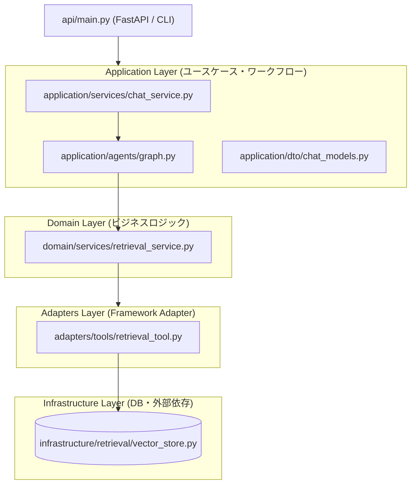
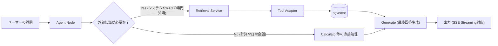

# Agentic RAG

自律的なツール選択（Agentic）と検索拡張生成（RAG）を組み合わせた、クリーンアーキテクチャ採用のプロダクトレベルLLMアプリケーション基盤です。

本プロジェクトは、常に無条件でベクトル検索（Retrieval）を実行する従来のRAGとは異なり、LLMエージェント自身が「検索が必要か」を見極め、必要な場合にのみ外部ナレッジ（ツール）にアクセスする高度な思考・ルーティングプロセスを実現します。

## 1. プロジェクト概要（何を解決するか）

多くのRAGシステムは「質問 -> 検索 -> 回答」という直線的なフローに依存しており、日常的な会話や検索が不要なタスクにおいても不要なクエリが発生する課題があります。
本プロジェクトは、LangGraphを利用した自律的ツール制御ループと、メンテナンス性の高いクリーンアーキテクチャ設計を導入しています。

- **動的なツール選択（Agent Routing）**: 必要なときだけの外部知識検索（Retrieval Tool）
- **Clean Architecture**: 業務ロジック、アダプター、インターフェースを疎結合に分離
- **リアルタイム生成（Streaming Response）**: トークン単位でのスムーズなSSEレスポンス
- **耐障害性（Tool Timeout & Retry）**: 外部API遅延に対するタイムアウトとフォールバック処理
- **Prompt Ops（Prompt Versioning）**: LangSmith Hubによるコード非依存のプロンプト運用
- **自動評価パイプライン（Evaluation）**: 意味的類似度とRecallによる検索精度の自動テスト

これにより、不要なAPIコストとレイテンシを削減し、拡張性と保守性に優れた堅牢なRAGシステムを実現します。

## 2. 設計思想（Agent思考とビジネスロジックの分離）

中核の設計判断は、エージェントの思考プロセスと各種ツール（ビジネス機能）を完全に分離することです。

- **思考フロー (Agent Layer)**: 言語モデルへのプロンプト指示、ルーティング判断、対話ステートの管理
- **機能的ツール (Domain/Adapters Layer)**: 検索（Retrieval）などの具体的なビジネスロジック

この分離により、今後システムに新しいアクション（例：社内API呼び出し、スラック通知など）を追加する際も、既存のエージェントの思考フローを壊すことなく `Tool` として安全に横積み（Plug & Play）で拡張可能です。
また、プロンプトの更新履歴やチューニングもLangSmith Hub上でコード実装（Git）とは独立して運用管理されるため、安全にA/Bテストを行えます。

## 3. アーキテクチャ設計（Clean Architecture）

依存性の逆転原則（DIP）に基づき、各責務を明確にレイヤー分けしています。これにより、特定のDB（pgvector）やLLMへの依存を最小限に抑え、高いテスト容易性と拡張性を確保しています。



| レイヤー | 役割 | 該当ディレクトリ |
| :--- | :--- | :--- |
| **API/Interface** | 外部入力を受け付け、Application層を呼び出す | `api/` および `main.py` |
| **Application** | ユースケースの実現。Agent（ワークフロー実行）やDTO定義を含む | `application/` |
| **Domain** | システムの中核となるビジネスロジック（検索フロー・タイムアウト等） | `domain/` |
| **Adapters** | フレームワーク（LangChain Tool等）への適合アダプタ | `adapters/` |
| **Infrastructure** | 特定の技術（pgvector / OpenAI等）に依存する具象実装 | `infrastructure/` |

## 4. コアフロー（Agent Routing -> Action -> Generate）



各レイヤーの依存方向は一方向に制御しています。
- **Interface** は Application に依存
- **Application** は Domain に依存
- **Domain** は Adapters を介して Infrastructure を呼び出す
- Agent（LangGraph）は下位の実装詳細（pgvectorなど）に直接依存しない

EmbeddingモデルやVector DBを（たとえば Pinecone等へ）差し替える場合も、該当するInfrastructureとAdapter層の変更のみで対応可能です。高い差し替え耐性を確保しています。

## 5. テスト・評価戦略

品質の劣化を防ぐため、評価用スクリプトによる自動計測を用意しています。

- **Recall@3 Rate**: 検索結果の上位3件に正解ドキュメントが含まれている確率（ベクトル検索精度）
- **Answer Similarity**: 期待される回答と生成回答の意味的一致度（GPT-4o等のLLM-as-a-judgeを利用）

これにより、システム改修やEmbeddingモデル変更等での「サイレントな精度悪化」を検知します。

## 5. 将来ビジョン（完全自律型アシスタントへの拡張）

将来的には、シンプルなRAGからより高度な Agentic Workflow へと発展させます。

- 複数ステップの推論（Plan & Solve）
- 会話履歴（Memory saver）の永続化と再利用
- ドキュメント単位の厳密な引用（Citation）トラッキング

## Quickstart

```bash
# パッケージのインストール
uv sync

# 環境変数の設定
cp .env.example .env
# .env を編集し、OPENAI_API_KEY 等を設定してください

# データベース（pgvector）の起動
docker compose up -d

# サンプルドキュメントのシード（初期化時のみ）
uv run python -m infrastructure.retrieval.vector_store
```

## エントリーポイント

- **CLI インタラクティブテスト**: `uv run python main.py`
- **精度評価 (Evaluation) スクリプト**: `uv run python evaluation/evaluate.py`
- **APIサーバ起動**: `uv run uvicorn api.main:app`
  - ストリーミングテスト例: 
    ```bash
    curl -N -X POST -H "Content-Type: application/json" -d '{"question":"What is pgvector?"}' http://localhost:8000/ask/stream
    ```
