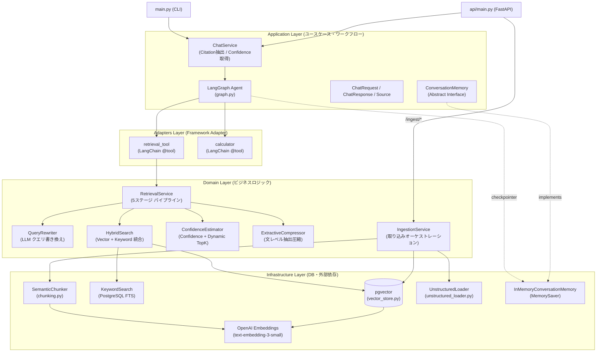
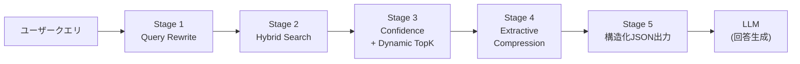
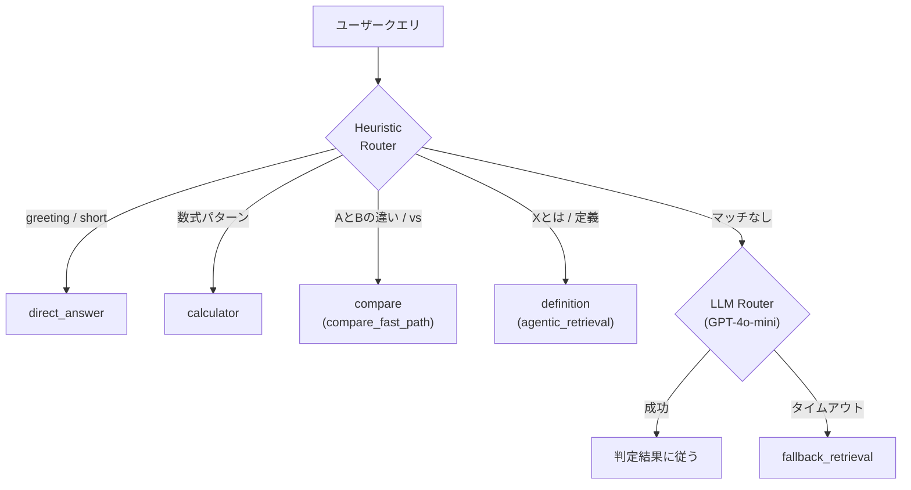
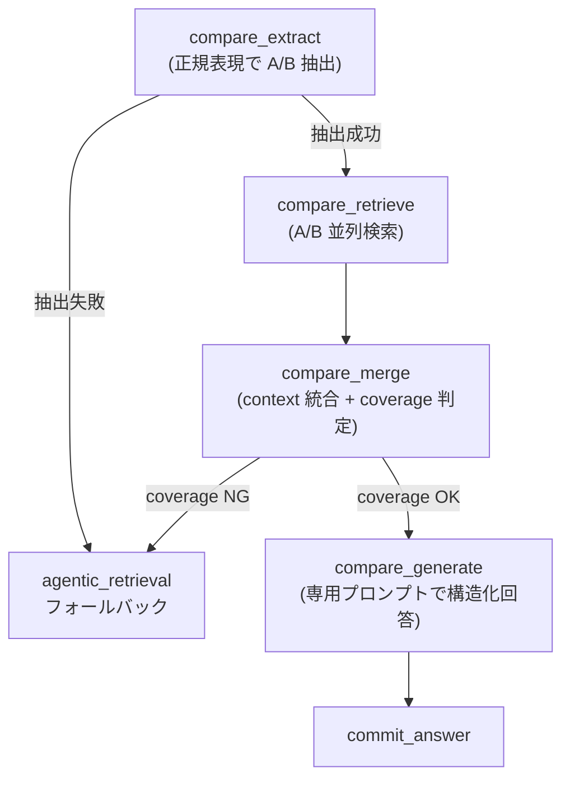
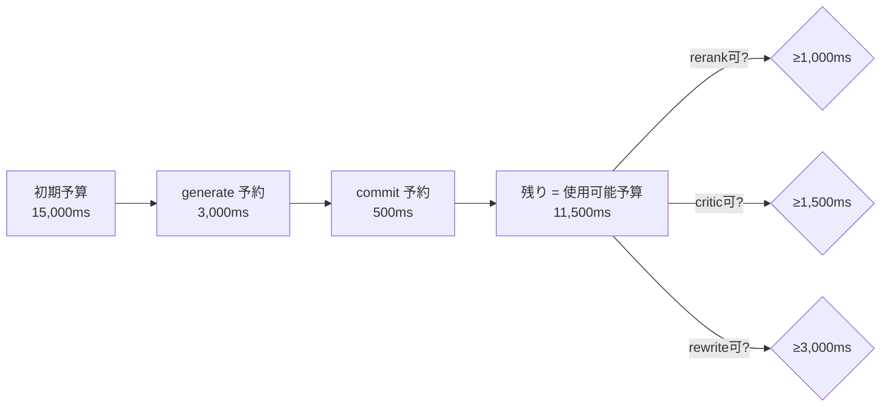
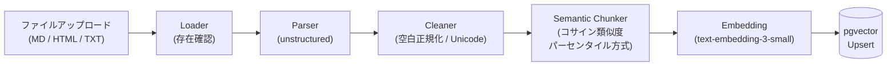
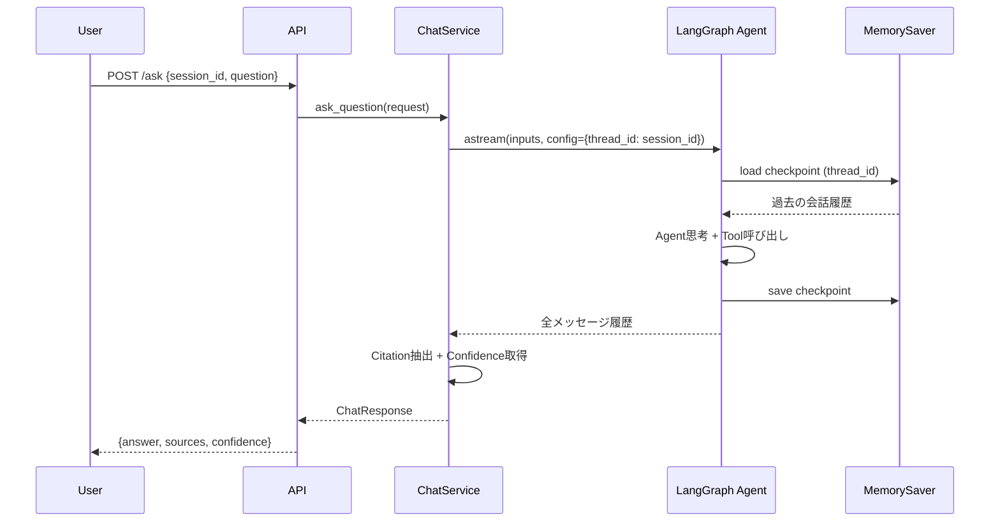

# Agentic RAG

自律的なツール選択（Agentic）と検索拡張生成（RAG）を組み合わせた、クリーンアーキテクチャ採用のプロダクトレベルLLMアプリケーション基盤です。

本プロジェクトは、常に無条件でベクトル検索（Retrieval）を実行する従来のRAGとは異なり、LLMエージェント自身が「検索が必要か」を見極め、必要な場合にのみ外部ナレッジ（ツール）にアクセスする高度な思考・ルーティングプロセスを実現します。

---

## 1. プロジェクト概要（何を解決するか）

多くのRAGシステムは「質問 -> 検索 -> 回答」という直線的なフローに依存しており、日常的な会話や検索が不要なタスクにおいても不要なクエリが発生する課題があります。
本プロジェクトは、LangGraphを利用した自律的ツール制御ループと、メンテナンス性の高いクリーンアーキテクチャ設計を導入しています。

### Phase 1: Agentic RAG Core

| 機能 | 概要 |
| :--- | :--- |
| **動的ツール選択（Agent Routing）** | LLMが自律的に「検索が必要か」を判断し、必要なときだけ Retrieval Tool を呼び出す |
| **Clean Architecture** | 業務ロジック、アダプター、インターフェースを疎結合にレイヤー分離 |
| **リアルタイム生成（SSE Streaming）** | トークン単位でのスムーズなストリーミングレスポンス（FastAPI SSE対応） |
| **耐障害性（Tool Timeout & Retry）** | 外部API遅延に対する `asyncio.wait_for` タイムアウト（5秒）とフォールバックエラー処理 |
| **Prompt Ops（Prompt Versioning）** | `prompts/` 配下のローカル snapshot を runtime 正本として利用し、LangSmith Hub は同期元として扱う |
| **自動評価パイプライン（Evaluation）** | Recall@3 と Answer Similarity（LLM-as-a-Judge）による検索精度の自動計測 |

### Phase 2: Production RAG（✅ 実装完了）

| 機能 | 概要 |
| :--- | :--- |
| **Conversation Memory** | `MemorySaver` によるセッション単位の会話履歴保持。`session_id` をキーとしたマルチターン対話を実現 |
| **Citation 付き回答** | `answer + sources[] + confidence` の構造化レスポンス。引用元ドキュメントの `doc_id / chunk_id / score / snippet` を追跡 |
| **Document Ingestion Pipeline** | `unstructured` ベースのマルチフォーマット（MD/HTML/TXT）取り込みパイプライン。API経由でのファイル/ディレクトリ一括取り込みに対応 |
| **Semantic Chunking** | `SemanticChunker`（コサイン類似度パーセンタイル方式）による意味的文脈を保持したチャンク分割 |

### Phase 2.5: Production RAG 強化（✅ 実装完了）

| 機能 | 概要 |
| :--- | :--- |
| **Query Rewrite** | LLM（GPT-4o-mini）による検索向けクエリ書き換え。`original_query` + `rewrite_query` の併用で検索精度向上 |
| **Hybrid Search** | Vector Search（pgvector） + Keyword Search（PostgreSQL FTS: tsvector/ts_rank）のスコア正規化・加重平均による統合検索 |
| **Confidence Estimation** | Hybrid Score 分布からのヒューリスティック信頼度算出: `clamp(0.2 + 0.6×top1 + 0.2×margin, 0, 1)` |
| **Dynamic TopK** | Confidence に基づく動的な取得件数制御（3〜8件を自動調整） |
| **Extractive Compression** | 文レベルの関連性判定による抽出圧縮。LLM入力のノイズとトークンコストを削減 |

### Phase 3: Control Plane Enhancements（✅ 実装完了）

Phase 3 では、Agentic RAG の制御面を強化し、ルーティング、比較処理、複雑検索に対して、レイテンシ・品質・縮退制御を改善しました。

#### Sprint 1: Heuristic Routing

| 機能 | 概要 |
| :--- | :--- |
| **Heuristic Router** | ルールベースの事前分類で `direct` / `calc` / `definition` / `compare` を高確信で即座に判定 |
| **LLM Router Skip** | Heuristic hit 時は LLM Router をスキップし、router timeout と不要な fallback を削減 |
| **Observability** | routing decision の structured observability を追加 |

#### Sprint 2: Compare Fast-Path

| 機能 | 概要 |
| :--- | :--- |
| **Compare 分離** | `query_type=compare` を専用パイプラインに分離し、比較対象ごとの独立並列検索を実現 |
| **Compare パイプライン** | intent 抽出 → target 別 retrieval → merge → 専用 generate → quality gate の5段構成 |
| **フォールバック** | 抽出失敗・coverage 不足時は `agentic_retrieval` へ自動フォールバック |

#### Sprint 3: Retrieval Complex Budget / Fallback Control

| 機能 | 概要 |
| :--- | :--- |
| **Budget-aware 制御** | `retrieval_complex` に `generate` / `commit` 予約付き budget 管理を導入 |
| **段階的縮退** | `fallback_level` による5段階縮退（full_path → optimization_skip → critic_skip → single_retrieval_fallback → minimal_answer） |
| **Partial Retrieval** | 並列検索の部分成功を許容し、全失敗と部分失敗を区別して品質判定 |
| **Warning / Observability** | `warning_codes`（内部）と user-facing `warning`（外部）を分離。`retrieval_quality_level` で品質段階を可視化 |
| **Dynamic Skip** | rerank / critic / rewrite を残予算に応じて段階的にスキップ |

これにより、不要なAPIコストとレイテンシを削減し、**企業利用に耐える高精度かつ自律的な Production RAG** を実現しています。

---

## 2. 設計思想（Agent思考とビジネスロジックの分離）

中核の設計判断は、エージェントの思考プロセスと各種ツール（ビジネス機能）を完全に分離することです。

- **思考フロー (Agent Layer)**: 言語モデルへのプロンプト指示、ルーティング判断、対話ステートの管理
- **機能的ツール (Domain/Adapters Layer)**: 検索（Retrieval）、ドキュメント取り込み（Ingestion）などの具体的なビジネスロジック

この分離により、今後システムに新しいアクション（例：社内API呼び出し、スラック通知など）を追加する際も、既存のエージェントの思考フローを壊すことなく `Tool` として安全に横積み（Plug & Play）で拡張可能です。
また、runtime で参照する prompt は Git 管理された `prompts/` 配下のローカル snapshot を正本とし、LangSmith Hub は同期元として扱います。これにより、本番実行経路は Hub 障害の影響を受けず、prompt 更新はレビュー可能な差分として管理できます。

---

## 3. アーキテクチャ設計（Clean Architecture）

依存性の逆転原則（DIP）に基づき、各責務を明確にレイヤー分けしています。これにより、特定のDB（pgvector）やLLMへの依存を最小限に抑え、高いテスト容易性と拡張性を確保しています。



### レイヤー責務一覧

| レイヤー | 役割 | 主要コンポーネント | 該当ディレクトリ |
| :--- | :--- | :--- | :--- |
| **API / Interface** | 外部入力を受け付け、Application層を呼び出す | FastAPI endpoints, CLI | `api/`, `main.py` |
| **Application** | ユースケースの実現。Agent実行・DTO定義・Citation抽出を含む | `ChatService`, `graph.py`, `ChatRequest/Response`, `ConversationMemory` IF | `application/` |
| **Domain** | ビジネスロジック（検索パイプライン・取り込みオーケストレーション） | `RetrievalService`, `QueryRewriter`, `HybridSearch`, `ConfidenceEstimator`, `ExtractiveCompressor`, `IngestionService` | `domain/` |
| **Adapters** | フレームワーク（LangChain Tool等）への適合アダプタ | `retrieval_tool`, `calculator` | `adapters/` |
| **Infrastructure** | 特定技術（pgvector / PostgreSQL FTS / OpenAI / unstructured 等）に依存する具象実装 | `vector_store`, `KeywordSearch`, `embedding`, `SemanticChunker`, `UnstructuredLoader`, `MemorySaver` | `infrastructure/` |

---

## 4. コアフロー

### 4.1 検索パイプライン（Phase 2.5: 5ステージ構成）



各ステージの詳細:

| ステージ | 処理 | フォールバック | レイテンシ予算 |
| :--- | :--- | :--- | :--- |
| **1. Query Rewrite** | LLM でクエリを検索向けに書き換え。`original` + `rewrite` を併用 | 失敗時は `original_query` のみ | 300ms |
| **2. Hybrid Search** | Vector（pgvector） + Keyword（PostgreSQL FTS）を並列実行。min-max 正規化後に加重平均 `hybrid_score = α×vector + (1-α)×bm25` | Keyword 失敗時は Vector のみ | 700ms |
| **3. Confidence + Dynamic TopK** | `clamp(0.2 + 0.6×top1 + 0.2×margin, 0, 1)` で確信度を算出。確信度に応じて取得件数を自動調整（3〜8件） | - | 100ms |
| **4. Extractive Compression** | チャンクを文単位に分割し、LLM で関連文のみ抽出。`source_spans` で Citation 追跡 | 失敗時は圧縮スキップ（元テキスト使用） | 800ms |
| **5. 構造化JSON出力** | `context`（圧縮テキスト） + `sources`（Citation メタデータ） + `confidence` を JSON で出力 | - | - |

**フォールバック優先順:** ① Compression skip → ② Rewrite skip → ③ Keyword skip（Vector only）

### 4.2 Routing Strategy（2段階ルーティング）

クエリは **Heuristic → LLM** の2段階で分類されます。Heuristic で高確信ルールにマッチすれば LLM 呼び出しをスキップし、0ms でルート決定します。



#### Query Type と Execution Route の対応

| `query_type` | `route` | 実行パス |
| :--- | :--- | :--- |
| `direct` | `direct_answer` | → generate → commit |
| `calc` | `calculator` | → calculator → generate → commit |
| `compare` | `agentic_retrieval` | → **compare_fast_path**（下記参照） |
| `definition` | `agentic_retrieval` | → retrieve → retrieval_critic → generate → answer_critic → commit |
| `retrieval_complex` | `agentic_retrieval` | → retrieve → critic → decompose/rewrite loop → generate → answer_critic → commit |

### 4.3 Compare Fast-Path

`query_type=compare` と判定されたクエリは、通常の検索パスではなく専用の比較パイプラインを通ります。



| ステージ | 処理内容 |
| :--- | :--- |
| **Intent Extract** | 正規表現で `target_a`, `target_b`, `aspect` を抽出。50文字超の対象名や抽出失敗時はフォールバック |
| **Target別 Retrieval** | `build_compare_subquery(target, aspect)` でキーワード拡張し、`asyncio.gather` で A/B を並列検索 |
| **Merge** | A/B の検索結果を `[Item A: ...]` / `[Item B: ...]` 形式に整形。片方でも取得 0 件なら `coverage_ok=False` |
| **Compare Generate** | 「共通点・相違点・向いているケース・注意点」の4観点を強制する専用プロンプトで回答生成 |
| **Quality Gate** | `quality_gate_status` (`pass` / `warning` / `fail`) と `quality_gate_confidence` を記録 |

### 4.4 Retrieval Complex — Budget / Fallback 制御

`query_type=retrieval_complex` のクエリに対し、予算管理と段階的縮退を適用します。



#### Fallback Level（段階的縮退）

| Level | 条件 | スキップされるステージ |
| :--- | :--- | :--- |
| `full_path` | 予算に余裕あり | なし（全ステージ実行） |
| `optimization_skip` | usable budget が rerank 閾値未満 | rerank |
| `critic_skip` | usable budget が critic 閾値未満 | rerank + retrieval_critic |
| `single_retrieval_fallback` | decompose/rewrite 不可 | rerank + critic + decompose/rewrite |
| `minimal_answer` | generate 予約すら枯渇 | 検索結果なしで直接回答 |

#### Partial Retrieval

並列検索（`asyncio.gather`）で一部のサブクエリが失敗しても、成功分のチャンクでマージ・生成を継続します。`retrieval_timeout_count` / `retrieval_success_count` で成功率を追跡し、`retrieval_quality_level` に反映します。

### 4.5 ドキュメント取り込みフロー（Ingestion Pipeline）



---

## 5. Conversation Memory（マルチターン対話）

`session_id` をキーとしたセッション単位の会話履歴保持を実現しています。



### アーキテクチャ設計ポイント

| 項目 | 設計 |
| :--- | :--- |
| **抽象インターフェース** | `ConversationMemory`（ABC）により永続化先の差し替えを保証（PostgreSQL / Redis等への移行が容易） |
| **現在の実装** | `InMemoryConversationMemory`（ `MemorySaver` ラップ）。アプリケーション再起動で履歴はリセット |
| **スレッド分離** | `thread_id`（= `session_id`）で会話を分離。ユーザー/セッション単位の文脈保持 |
| **グラフ統合** | `builder.compile(checkpointer=...)` により、LangGraphの状態管理にシームレスに組み込み |

---

## 6. Hybrid Search & Confidence 詳細

### 6.1 Hybrid Search のスコア統合

```
hybrid_score = α × norm_vector + (1 - α) × norm_bm25
```

| パラメータ | デフォルト値 | 説明 |
| :--- | :--- | :--- |
| `HYBRID_ALPHA` | `0.6` | Vector Search の重み（0.0〜1.0） |
| `RETRIEVE_K_VECTOR` | `30` | Vector Search の初期取得件数 |
| `RETRIEVE_K_KEYWORD` | `30` | Keyword Search の初期取得件数 |

- **Vector Search**: pgvector の `asimilarity_search_with_score`（コサイン距離→類似度変換）
- **Keyword Search**: PostgreSQL FTS（`to_tsvector('simple', ...) @@ plainto_tsquery('simple', ...)`）+ `ts_rank`
- 各スコアセットを **min-max 正規化** してから加重平均

### 6.2 Confidence & Dynamic TopK

```
confidence = clamp(0.2 + 0.6 × top1_score + 0.2 × margin, 0.0, 1.0)
```

| 条件 | Dynamic TopK | 根拠 |
| :--- | :--- | :--- |
| `top1 ≥ 0.85` かつ `margin ≥ 0.05` | **3** 件 | 高い確信度 → 少数で十分 |
| `top1 ≥ 0.70` | **5** 件 | 中程度の確信度 |
| その他 | **8** 件 | 低い確信度 → 多めに取得 |

### 6.3 レスポンスモデル（`ChatResponse`）

```python
class Source(BaseModel):
    doc_id: str        # ソースドキュメント識別子
    chunk_id: str      # チャンク識別子（例: "architecture.md#c1"）
    snippet: str       # テキスト抜粋
    score: float       # 統合スコア（= hybrid_score）
    hybrid_score: float  # Hybrid Search 加重平均スコア
    vector_score: float  # Vector Search 正規化スコア
    bm25_score: float    # Keyword Search 正規化スコア

class ChatResponse(BaseModel):
    answer: str            # エージェントの最終回答
    sources: List[Source]  # 引用元のリスト
    confidence: float      # 信頼度スコア（0.0〜1.0）
```

---

## 7. Observability

各ノードは構造化ログ（`logger.info({"event": ...})`）を出力します。以下は記録されている主要な項目です。

### Routing

| フィールド | 説明 |
| :--- | :--- |
| `routing_layer` | `heuristic` / `llm` / `fallback` |
| `route_decision_source` | `heuristic_match` / `llm_success` / `llm_timeout_fallback` / `llm_error_fallback` |
| `heuristic_matched` | Heuristic ルールにマッチしたか |
| `heuristic_rule` | マッチしたルール名（`direct_greeting`, `calc_expression`, `compare_keywords`, `definition_keywords`） |
| `route_decision_latency_ms` | ルーティング解決にかかった時間 |
| `route_decision_confidence` | 判定の確信度 |
| `llm_router_invoked` | LLM Router が呼び出されたか |

### Compare Fast-Path

| フィールド | 説明 |
| :--- | :--- |
| `compare_extract_success` | A/B 対象の抽出成功フラグ |
| `compare_targets` | `{target_a, target_b}` |
| `compare_doc_count_a` / `_b` | A/B それぞれの検索ヒット件数 |
| `compare_context_coverage_ok` | merge 後の coverage 判定結果 |
| `compare_route_fallback_used` | agentic_retrieval へのフォールバック有無 |
| `quality_gate_status` | `pass` / `warning` / `fail` |

### Budget / Fallback

| フィールド | 説明 |
| :--- | :--- |
| `initial_budget_ms` | クエリに割り当てられた初期予算 |
| `remaining_budget_ms` | 各ノード通過時点の残予算 |
| `fallback_level` | 現在の縮退レベル |
| `skipped_stages` | 予算不足でスキップされたステージ一覧 |
| `budget_pressure_reasons` | 予算圧迫の要因 |
| `must_generate` | Generate 強制遷移フラグ |
| `retrieval_degraded` | 検索品質縮退フラグ |
| `warning_codes` | 内部 warning コード一覧 |
| `retrieval_quality_level` | 検索品質の段階（内部判定） |
| `timeout_stages` / `fallback_stages` | タイムアウト/フォールバックが発生したステージ |

---

## 8. テスト・評価戦略

品質の劣化を防ぐため、評価用スクリプトによる自動計測を用意しています。

| 指標 | 評価内容 | 算出方法 |
| :--- | :--- | :--- |
| **Recall@3** | 検索結果の上位3件に正解ドキュメントが含まれている確率 | 日本語対応バイグラム一致率（50%閾値） |
| **Answer Similarity** | 期待回答と生成回答の意味的一致度 | GPT-4o による LLM-as-a-Judge（0.0〜1.0スコア） |

これにより、Embeddingモデル変更やChunking戦略変更等での **「サイレントな精度悪化」** を検知します。

**レイテンシ予算（P95 < 3s）:**

| ステージ | 予算 |
| :--- | :--- |
| Query Rewrite | 300ms |
| Hybrid Search | 700ms |
| Confidence + TopK | 100ms |
| Extractive Compression | 800ms |
| LLM / overhead | 1,100ms |
| **合計** | **3,000ms** |

---

## 9. ディレクトリ構成

```
ai-agent-rag/
├── main.py                                  # CLI エントリーポイント
├── pyproject.toml                           # プロジェクト定義 (uv)
├── docker-compose.yml                       # pgvector コンテナ定義
├── .env.example                             # 環境変数テンプレート
│
├── config/                                  # --- Configuration Layer ---
│   └── settings.py                          #   環境変数・レイテンシ予算・しきい値設定
│
├── api/                                     # --- API / Interface Layer ---
│   ├── main.py                              #   FastAPI アプリケーション (v2.0.0)
│   └── routers/
│       └── ingest.py                        #   POST /ingest/file, /ingest/directory
│
├── application/                             # --- Application Layer ---
│   ├── agents/
│   │   ├── graph.py                         #   LangGraph ステートグラフ定義 + Control Plane
│   │   └── state.py                         #   AgentState定義 (メタデータ・予算情報保持)
│   ├── dto/
│   │   └── chat_models.py                   #   ChatRequest / ChatResponse / Source
│   ├── interfaces/
│   │   └── conversation_memory.py           #   ConversationMemory ABC (DIP)
│   └── services/
│       └── chat_service.py                  #   ユースケース + Citation抽出 + Confidence取得
│
├── domain/                                  # --- Domain Layer ---
│   ├── models/
│   │   └── retrieval_models.py              #   RetrievedChunk / RewriteResult / CompressionResult
│   └── services/
│       ├── router.py                        #   経路ルーティング (Heuristic + LLM Facade)
│       ├── heuristic_router.py              #   Heuristic分類ルール
│       ├── retrieval_budget.py              #   レイテンシ予算管理 + 段階的縮退判定
│       ├── retrieval_service.py             #   5ステージ検索パイプライン
│       ├── query_decomposer.py              #   Lazy Decomposition / Query Rewrite
│       ├── result_merger.py                 #   Max Pooling Merge (検索結果統合)
│       ├── retrieval_critic.py              #   Retrieval Critic (検索結果の品質評価)
│       ├── answer_critic.py                 #   Answer Critic (最終回答の検証)
│       ├── compare_intent.py                #   Compare: 正規表現による A/B 抽出
│       ├── compare_retrieval.py             #   Compare: subquery builder + 並列検索
│       ├── compare_merge.py                 #   Compare: コンテキスト統合 + coverage 判定
│       ├── coverage_checker.py              #   回答の網羅性チェック (entity/axis)
│       ├── confidence.py                    #   Confidence 算出 + Dynamic TopK
│       ├── prompt_loader.py                 #   Prompt Ops (ローカル読込 + fallback)
│       ├── prompt_registry.py               #   Prompt 定義レジストリ
│       ├── prompt_formats.py                #   YAML ↔ ChatPromptTemplate 変換
│       ├── prompt_sync.py                   #   LangSmith Hub 同期ロジック
│       ├── query_rewriter.py                #   LLM クエリ書き換え
│       ├── hybrid_search.py                 #   Vector + Keyword 統合検索
│       ├── compressor.py                    #   Extractive Compression
│       └── ingestion_service.py             #   取り込みオーケストレーション
│
├── adapters/                                # --- Adapters Layer ---
│   └── tools/
│       ├── retrieval_tool.py                #   LangChain @tool ラッパー（検索）
│       └── calculator.py                    #   LangChain @tool ラッパー（計算）
│
├── infrastructure/                          # --- Infrastructure Layer ---
│   ├── ingestion/
│   │   └── unstructured_loader.py           #   unstructured パーサー (MD/HTML/TXT)
│   ├── memory/
│   │   └── in_memory_memory.py              #   MemorySaver ラッパー (InMemory実装)
│   └── retrieval/
│       ├── reranker.py                      #   Cohere Reranker / Passthrough (Feature Flag)
│       ├── vector_store.py                  #   pgvector 接続・シード・非同期対応
│       ├── keyword_search.py                #   PostgreSQL FTS (tsvector / ts_rank)
│       ├── embedding.py                     #   OpenAI Embeddings (text-embedding-3-small)
│       └── chunking.py                      #   SemanticChunker (コサイン類似度パーセンタイル)
│
├── prompts/                                 # --- Prompt Ops ---
│   ├── router/v1.yaml                       #   Router用プロンプト
│   ├── decompose/v1.yaml                    #   Decomposer用プロンプト
│   ├── rewrite/v1.yaml                      #   Rewrite用プロンプト
│   ├── retrieval_critic/v1.yaml             #   Retrieval Critic用プロンプト
│   ├── answer_critic/v1.yaml                #   Answer Critic用プロンプト
│   ├── generate/v1.yaml                     #   Generate用プロンプト
│   └── compare_generate.yaml                #   Compare 専用 Generate プロンプト
│
├── tools/                                   # --- 運用ツール ---
│   └── sync_prompts_from_hub.py             #   LangSmith Hub → local 同期
│
├── scripts/                                 # --- ベンチマーク ---
│   ├── benchmark_router.py                  #   Router ベンチマーク (Before/After)
│   └── benchmark_compare.py                 #   Compare Pipeline ベンチマーク
│
├── tests/                                   # --- テスト ---
│   ├── test_compare_intent.py               #   Compare 意図抽出テスト (15件)
│   ├── test_compare_pipeline.py             #   Compare パイプライン E2E テスト
│   ├── test_heuristic_router.py             #   Heuristic Router テスト
│   ├── test_router_service.py               #   Router Facade テスト
│   ├── test_critic_fallbacks.py             #   Critic フォールバックテスト
│   ├── test_prompt_loader.py                #   Prompt Loader テスト
│   ├── test_prompt_sync.py                  #   Prompt Sync テスト
│   └── test_retrieval_complex_budget.py     #   Budget / Fallback テスト
│
├── evaluation/                              # --- 評価パイプライン ---
│   ├── evaluate.py                          #   Recall@3 + Answer Similarity 自動評価
│   └── dataset.json                         #   評価用データセット
│
└── docs/                                    # --- 設計ドキュメント ---
    ├── phase2-production-rag.md              #   Phase 2 設計書
    ├── phase2-5-design.md                    #   Phase 2.5 設計書
    └── phase3-agentic-retrieval-v2.md        #   Phase 3 設計書
```

---

## 10. 技術スタック

| カテゴリ | 技術 | バージョン要件 |
| :--- | :--- | :--- |
| **言語** | Python | >= 3.13 |
| **パッケージ管理** | uv | - |
| **LLMフレームワーク** | LangChain / LangGraph / LangSmith | >= 1.2 / >= 1.1 / >= 0.1 |
| **LLM** | OpenAI GPT-4o-mini（推論・Rewrite・Compress） / GPT-4o（評価） | - |
| **Embedding** | OpenAI text-embedding-3-small | - |
| **チャンキング** | LangChain Experimental SemanticChunker | >= 0.4 |
| **ドキュメントパーサー** | unstructured | >= 0.21 |
| **Vector DB** | pgvector（PostgreSQL拡張） | pg16 |
| **全文検索** | PostgreSQL FTS（tsvector / ts_rank） | pg16 |
| **ORM / DB接続** | SQLAlchemy (asyncio) / psycopg | >= 2.0 / >= 3.3 |
| **APIフレームワーク** | FastAPI + Uvicorn | >= 0.135 |
| **コンテナ** | Docker Compose | - |

---

## 11. 設定項目一覧

| 環境変数 | デフォルト | 説明 |
| :--- | :--- | :--- |
| `OPENAI_API_KEY` | - | OpenAI API キー |
| `COHERE_API_KEY` | - | Cohere API キー (ENABLE_RERANK=true時に必須) |
| `ENABLE_AGENTIC` | `true` | Agentic RAG (Loop/Critic) の有効化 |
| `ENABLE_RERANK` | `false` | Reranker (Cohere) の有効化 |
| `ANSWER_CRITIC` | `true` | Answer Critic による回答検証の有効化 |
| `ANSWER_CRITIC_RETRY` | `false` | Answer Critic FAIL時に再検索を試行するか |
| `MAX_RETRY` | `3` | Agentic Loop の最大リトライ回数 |
| `MAX_SUB_QUERIES` | `4` | Decomposition 時の最大 Sub-query 数 |
| `MAX_MERGED_CHUNKS` | `20` | マージ・Rerank 後の最終チャンク上限数 |
| **Budget & Control Plane** | | |
| `COMPLEX_BUDGET_MS_LOW` | `4000` | 複雑度 Low クエリの初期予算 (ms) |
| `COMPLEX_BUDGET_MS_MEDIUM`| `7000` | 複雑度 Medium クエリの初期予算 (ms) |
| `COMPLEX_BUDGET_MS_HIGH` | `9000` | 複雑度 High クエリの初期予算 (ms) |
| `BUDGET_TOTAL_RETRIEVAL_COMPLEX_MS` | `15000` | `retrieval_complex` 用の最大予算 (ms) |
| `BUDGET_RESERVED_GENERATE_MS` | `3000` | Generate ノード用に予約する予算 (ms) |
| `BUDGET_RESERVED_COMMIT_MS` | `500` | Commit ノード用に予約する予算 (ms) |
| `BUDGET_MIN_FOR_RERANK_MS` | `1000` | Rerank 実行に必要な最低 usable 予算 (ms) |
| `BUDGET_MIN_FOR_CRITIC_MS` | `1500` | Critic 実行に必要な最低 usable 予算 (ms) |
| `BUDGET_MIN_FOR_REWRITE_MS` | `3000` | Rewrite 実行に必要な最低 usable 予算 (ms) |
| `RETRIEVAL_DEGRADE_THRESHOLD_MS` | `2000` | 残り予算がこれを下回ると Rerank/Rewrite 等をスキップ |
| `FORCE_GENERATE_THRESHOLD_MS` | `1500` | 残り予算がこれを下回ると強制的に Generate へ遷移 |
| `RETRIEVAL_CRITIC_SKIP_CONFIDENCE_PCT` | `85` | 確信度が 85% 超の場合に Retrieval Critic をスキップ |
| `ANSWER_CRITIC_SKIP_CONFIDENCE_PCT` | `80` | 確信度が 80% 超の場合に Answer Critic をスキップ |
| **Timeouts (ms)** | | |
| `STAGE_TIMEOUT_MS_ROUTER` | `1800` | Router ノードのタイムアウト |
| `STAGE_TIMEOUT_MS_RETRIEVAL_CRITIC` | `2500` | Retrieval Critic のタイムアウト |
| `STAGE_TIMEOUT_MS_ANSWER_CRITIC` | `2500` | Answer Critic のタイムアウト |
| `STAGE_TIMEOUT_MS_DECOMPOSE` | `1800` | Decompose ノードのタイムアウト |
| `STAGE_TIMEOUT_MS_REWRITE_SUBQUERY` | `1800` | Rewrite ノードのタイムアウト |
| `STAGE_TIMEOUT_MS_RERANK` | `2500` | Reranker のタイムアウト |
| **Router & Others** | | |
| `ROUTER_HEURISTIC_ENABLED` | `true` | ルールベース Router の有効化 |
| `ROUTER_HEURISTIC_COMPARE_ENABLED` | `true` | Compare ヒューリスティックの有効化 |
| `ROUTER_BUDGET_MS` | `500` | Router 処理に割り当てる予算 |
| `PROMPT_NAMESPACE` | `my-rag` | LangSmith Hub 同期時に使う namespace |
| `LANGCHAIN_TRACING_V2` | `true` | LangSmith トレーシング有効化 |
| `PREWARM_FAIL_FAST` | `true` | 起動時の Prompt 読込失敗でプロセスを落とすか |


## 12. Known Limitations

| 分類 | 制約事項 |
| :--- | :--- |
| **Compare** | 正規表現ベースの抽出のため、3つ以上の対象比較（A vs B vs C）には未対応 |
| **Compare** | 比較対象の表記揺れ（例: 「ファインチューニング」と「Fine-tuning」）は `coverage_checker` のエイリアスで部分対応しているが、網羅性に限界あり |
| **Heuristic Router** | 「RAGのメリットとデメリット」のような1対象の長所短所クエリを compare と誤分類する場合がある |
| **Budget** | `retrieval_complex` の 15s 予算は LLM レイテンシのばらつきにより、高負荷時に不足する場合がある |
| **Memory** | `MemorySaver`（InMemory）のため、プロセス再起動で会話履歴が消失する |
| **Ingestion** | PDF パーサーは未対応（MD / HTML / TXT のみ） |

---

## 13. Future Work

以下は現時点で未実装だが、次のフェーズでの対応を検討している改善候補です。

- **永続化メモリ**: `MemorySaver` から PostgreSQL / Redis ベースの永続チェックポインタへ移行
- **LLM-as-a-Judge Confidence**: ヒューリスティック方式から LLM 評価による信頼度算出への進化
- **PDF / マルチモーダル対応**: Ingestion Pipeline での PDF / 画像 / 表の取り込みと検索
- **Multi-target Compare**: 3つ以上の対象比較クエリへの対応
- **Adaptive Budget**: クエリ複雑度 × 過去のレイテンシ実績に基づく動的予算調整
- **Cross-encoder Reranker**: Cohere Reranker の本番有効化と精度検証

---

## Quickstart

```bash
# パッケージのインストール
uv sync

# 環境変数の設定
cp .env.example .env
# .env を編集し、以下のキーを設定してください:
#   OPENAI_API_KEY       - OpenAI APIキー
#   LANGSMITH_API_KEY    - LangSmith APIキー
#   LANGSMITH_WORKSPACE_ID - private prompt sync 時に必要なら設定
#   POSTGRES_*           - PostgreSQL接続情報（デフォルト値あり）
#   HYBRID_ALPHA 等      - 検索パイプライン設定（デフォルト値あり）

# データベース（pgvector）の起動
docker compose up -d

# サンプルドキュメントのシード（初回のみ）
uv run python -m infrastructure.retrieval.vector_store
```

## Prompt Sync Operations

runtime では `prompts/` 配下のローカル snapshot を正本として読み込みます。LangSmith Hub は sync source であり、サーバー実行時に直接参照しません。

### 基本コマンド

```bash
# 差分確認のみ。local は更新しない
./.venv/bin/python -m tools.sync_prompts_from_hub --dry-run --verbose

# 特定 prompt のみ同期
./.venv/bin/python -m tools.sync_prompts_from_hub --only router --verbose

# CI 用。差分があれば exit code 2
./.venv/bin/python -m tools.sync_prompts_from_hub --dry-run --fail-on-diff
```

### Exit Code

| exit code | 意味 |
| :--- | :--- |
| `0` | 成功。差分なし、または `--fail-on-diff` を使わずに dry-run 成功 |
| `1` | sync 失敗。Hub pull / validation / local version 読み込みのいずれかが失敗 |
| `2` | `--fail-on-diff` 指定時に差分を検出 |

### ログの見方

- `changed_keys`: Hub と local snapshot の内容差分があった prompt key 一覧
- `failed_keys`: pull / validate に失敗した prompt key 一覧
- `prompt_version`: local file 内の version。Hub から同期しても維持される
- `resolution_source=local`: runtime/startup は local snapshot を参照していることを示す

### 運用メモ

- sync は `Hub -> local snapshot` の単方向です
- 保存は temp staging 後に全件成功時のみ一括反映します
- 保存後は local loader で再読込し、self-check を行います
- noisy diff を減らすため、比較は raw YAML ではなく正規化 dump を使います

## エントリーポイント

| コマンド | 用途 |
| :--- | :--- |
| `uv run python main.py` | CLI インタラクティブチャット（マルチターン対話対応） |
| `uv run python evaluation/evaluate.py` | 精度評価スクリプト（Recall@3 + Answer Similarity） |
| `uv run uvicorn api.main:app` | FastAPI サーバ起動（v2.0.0） |

### API エンドポイント一覧

| メソッド | パス | 概要 |
| :--- | :--- | :--- |
| `GET` | `/` | ヘルスチェック |
| `POST` | `/ask` | 質問応答（Hybrid Search + Citation + Confidence 付き） |
| `POST` | `/ask/stream` | ストリーミング質問応答（SSE） |
| `POST` | `/ingest/file` | 単一ファイルの取り込み（マルチパートアップロード） |
| `POST` | `/ingest/directory` | ディレクトリ内ファイルの一括取り込み |

### 使用例

```bash
# 1. 質問応答（Hybrid Search + Citation付き）
curl -s -X POST -H "Content-Type: application/json" \
  -d '{"session_id":"test-001","question":"pgvectorとは何ですか？"}' \
  http://localhost:8000/ask | python -m json.tool

# 2. ストリーミング質問応答
curl -N -X POST -H "Content-Type: application/json" \
  -d '{"session_id":"test-001","question":"RAGの仕組みを説明してください"}' \
  http://localhost:8000/ask/stream

# 3. ドキュメントの取り込み（ファイルアップロード）
curl -X POST -F "file=@./docs/my_document.md" \
  http://localhost:8000/ingest/file

# 4. ディレクトリ一括取り込み
curl -X POST -H "Content-Type: application/json" \
  -d '{"directory_path":"/path/to/docs"}' \
  http://localhost:8000/ingest/directory
```
