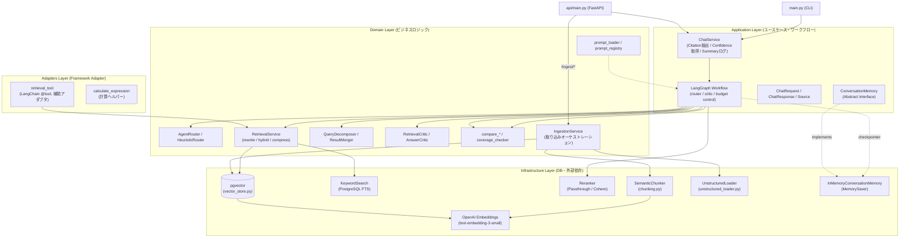
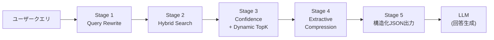
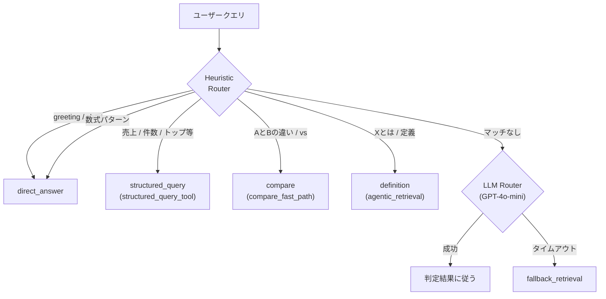
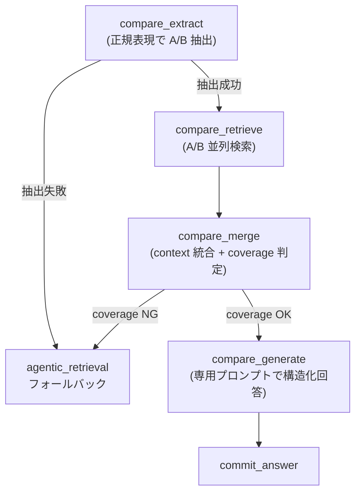
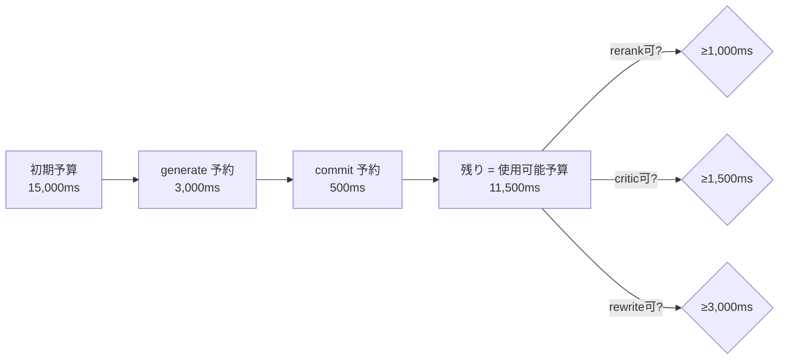
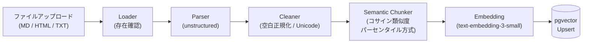

# Agentic RAG with Control Plane

> クエリ特性に応じて回答経路を動的制御するAgentic RAG

---

## ポートフォリオ内での位置づけ

本リポジトリは、生成AIを業務システムへ安全に導入するための
「品質保証 × 動的制御 × 運用統治」3層構成のポートフォリオの
**第2弾「動的制御」** に位置づけられます。

| 位置 | リポジトリ | レイヤー |
|---|---|---|
| 第1弾 | [Retrieval品質管理システム](https://github.com/mlprototype/spec-rag-qa) | 品質保証 |
| **第2弾** | **本リポジトリ（Agentic RAG with Control Plane）** | **動的制御** |
| 第3弾 | [Policy-Aware Multi-LLM Gateway](https://github.com/mlprototype/policy-aware-llm-gateway) | 運用統治 |

---

## 解決する課題

多くのRAGシステムは「質問 -> 検索 -> 回答」という直線的なフローに依存しており、日常的な会話や検索が不要なタスクにおいても不要なクエリが発生する課題があります。
本プロジェクトは、LangGraph を利用した router / critic / budget-aware state graph と、メンテナンス性の高いクリーンアーキテクチャ設計を導入しています。

---

## システム概要

自律的なルーティング（Agentic control plane）と検索拡張生成（RAG）を組み合わせた、Clean Architecture採用のLLMアプリケーション基盤です。

本プロジェクトは、常に無条件で検索を実行する従来のRAGとは異なり、LangGraph ベースの router / critic / budget-aware graph が「検索が必要か」「どこまで検索を続けるか」「不足時にどう縮退するか」を判断します。現在の中心実装は汎用 tool calling よりも、明示的な状態遷移グラフによる制御です。

---

## 想定ユースケース

### 問い合わせ内容に応じて回答経路を動的に切り替える業務QAエージェント

社内ヘルプデスク、業務問い合わせ、仕様確認、FAQ検索などの問い合わせ対応において、質問内容に応じて最適な処理経路を選択するAIエージェントを想定。

すべての質問に対して一律にRAGを実行すると、以下の問題が発生する。

- 単純な質問にも検索・LLM呼び出しが走り、コストが増える
- 比較質問や条件付き質問に対して通常RAGだけでは精度が出にくい
- 構造化データを参照すべき質問に対して、文書検索だけで回答してしまう
- 検索結果が不足している場合でも無理に回答してしまう
- Fallbackや段階的縮退がないと、障害時にUXが悪化する

このシステムでは、LangGraphによる状態遷移制御とHeuristic + LLM Routerにより、質問内容に応じて処理経路を動的に切り替える。

---

## アーキテクチャ

依存性の逆転原則（DIP）に基づき、各責務を明確にレイヤー分けしています。これにより、特定のDB（pgvector）やLLMへの依存を最小限に抑え、高いテスト容易性と拡張性を確保しています。



### レイヤー責務一覧

| レイヤー | 役割 | 主要コンポーネント | 該当ディレクトリ |
| :--- | :--- | :--- | :--- |
| **API / Interface** | 外部入力を受け付け、Application層を呼び出す | FastAPI endpoints, CLI | `api/`, `main.py` |
| **Application** | ユースケースの実現。Graph 実行・DTO定義・Citation抽出・要約ログ出力を担当 | `ChatService`, `graph.py`, `ChatRequest/Response`, `ConversationMemory` IF | `application/` |
| **Domain** | ビジネスロジック（router / retrieval / compare / critic / prompt ops / ingestion） | `AgentRouter`, `HeuristicRouter`, `RetrievalService`, `QueryDecomposer`, `ResultMerger`, `RetrievalCritic`, `AnswerCritic`, `coverage_checker`, `prompt_loader`, `prompt_sync`, `IngestionService` | `domain/` |
| **Adapters** | フレームワークや補助関数への適合レイヤー | `retrieval_tool`, `calculate_expression` | `adapters/` |
| **Infrastructure** | 特定技術（pgvector / PostgreSQL FTS / OpenAI / Cohere / unstructured 等）に依存する具象実装 | `vector_store`, `KeywordSearch`, `reranker`, `embedding`, `SemanticChunker`, `UnstructuredLoader`, `MemorySaver` | `infrastructure/` |

---

## 設計思想

中核の設計判断は、エージェントの思考プロセスと各種ツール（ビジネス機能）を完全に分離することです。

- **思考フロー (Agent Layer)**: 言語モデルへのプロンプト指示、ルーティング判断、対話ステートの管理
- **機能的ツール (Domain/Adapters Layer)**: 検索（Retrieval）、ドキュメント取り込み（Ingestion）などの具体的なビジネスロジック

この分離により、今後システムに新しいアクション（例：社内API呼び出し、スラック通知など）を追加する際も、既存のエージェントの思考フローを壊すことなく `Tool` として安全に横積み（Plug & Play）で拡張可能です。
また、runtime で参照する prompt は Git 管理された `prompts/` 配下のローカル snapshot を正本とし、LangSmith Hub は同期元として扱います。これにより、本番実行経路は Hub 障害の影響を受けず、prompt 更新はレビュー可能な差分として管理できます。FastAPI サーバ起動時は registry に登録された prompt を prewarm し、critical prompt がローカルで解決できない場合は `PREWARM_FAIL_FAST` に応じて fail-fast します。

---

## コアフロー

### 検索パイプライン（Phase 2.5: 5ステージ構成）



各ステージの詳細:

| ステージ | 処理 | フォールバック | レイテンシ予算 |
| :--- | :--- | :--- | :--- |
| **1. Query Rewrite** | LLM でクエリを検索向けに書き換え。`original` + `rewrite` を併用 | 失敗時は `original_query` のみ | 300ms |
| **2. Hybrid Search** | Vector（pgvector） + Keyword（PostgreSQL FTS）を並列実行。min-max 正規化後に加重平均 `hybrid_score = α×vector + (1-α)×bm25` | Keyword 失敗時は Vector のみ | 700ms |
| **3. Confidence + Dynamic TopK** | `clamp(0.2 + 0.6×top1 + 0.2×margin, 0, 1)` で確信度を算出。確信度に応じて取得件数を自動調整（3〜8件） | - | 100ms |
| **4. Extractive Compression** | チャンクを文単位に分割し、LLM で関連文のみ抽出。`source_spans` で Citation 追跡 | 失敗時は圧縮スキップ（元テキスト使用） | 800ms |
| **5. 構造化JSON出力** | `context`（圧縮テキスト） + `sources`（Citation メタデータ） + `confidence` を JSON で出力 | - | - |

**フォールバック優先順:** ① Compression skip → ② Rewrite skip → ③ Keyword skip（Vector only）

※ `graph.py` の agentic 経路では、この5ステージの前後に `ResultMerger` / optional `Reranker` / `RetrievalCritic` / `AnswerCritic` が重なります。`ENABLE_RERANK=false` の既定では `PassthroughReranker` が `hybrid_score` をそのまま `rerank_score` に反映します。

### Routing Strategy（2段階ルーティング）

クエリは **Heuristic → LLM** の2段階で分類されます。Heuristic で高確信ルールにマッチすれば LLM 呼び出しをスキップし、0ms でルート決定します。



#### Query Type と Execution Route の対応

| `query_type` | `route` | 実行パス |
| :--- | :--- | :--- |
| `direct` | `direct_answer` | → generate → commit |
| `calc` | `direct_answer` | → direct_generate（数式評価ユーティリティ） → commit |
| `structured_query` | `structured_query_tool` | → parse → validate → execute → commit |
| `compare` | `agentic_retrieval` | → **compare_fast_path**（下記参照） |
| `definition` | `agentic_retrieval` | → retrieve → retrieval_critic → generate → answer_critic → commit |
| `retrieval_complex` | `agentic_retrieval` | → retrieve → critic → decompose/rewrite loop → generate → answer_critic → commit |

#### 各ルートの役割分担と Structured Query の価値

Agentic RAG の価値は、Control Plane（ルーター）が質問 of 性質に応じて適切な処理経路を選択する点にあります。無条件に検索を実行するのではなく、目的に応じて以下のように経路を分離して扱います。

- **agentic_retrieval (RAG)**: 非構造化知識（マニュアル、社内規定などのドキュメント）向け。Vector + Keyword の Hybrid Search でコンテキストを収集します。
- **structured_query_tool**: 構造化データ（売上、在庫、注文件数などの業務データ）向け。SQLite 上で安全な集計 SQL を実行し、確定的な値を返します。
- **compare_fast_path**: 比較専用（AとBの違いなど）。対象を特定して並列検索を行う特化型経路です。

**数式評価 (calc) の扱いについて**:
`calc` は、質問自体が純粋な算術計算（例：「1+1は？」）である場合に適用されます。以前は独立した `calculator` ルートを使用していましたが、現在は `direct_answer` ルート内の**決定論的な数式評価ユーティリティ**として整理されています。これにより、LLM の推論エラーを避けつつ、グラフ構造を簡素化しています。

一方で、データセットに基づく業務的な集計（ランキング、件数、平均など）は、すべて `structured_query_tool` が担当します。

`ROUTER_HEURISTIC_CONFIDENCE_THRESHOLD_PCT` の既定値は `85` です。LLM Router が timeout / error の場合は `route=fallback_retrieval` に落とし、`retrieve_once → generate → commit` の単発経路で応答します。

### Compare Fast-Path

`query_type=compare` と判定されたクエリは、通常の検索パスではなく専用の比較パイプラインを通ります。



| ステージ | 処理内容 |
| :--- | :--- |
| **Intent Extract** | 正規表現で `target_a`, `target_b`, `aspect` を抽出。50文字超の対象名や抽出失敗時はフォールバック |
| **Target別 Retrieval** | `build_compare_subquery(target, aspect)` でキーワード拡張し、`asyncio.gather` で A/B を並列検索 |
| **Merge** | A/B の検索結果を `[Item A: ...]` / `[Item B: ...]` 形式に整形。片方でも取得 0 件なら `coverage_ok=False` |
| **Compare Generate** | 「共通点・相違点・向いているケース・注意点」の4観点を強制する専用プロンプトで回答生成 |
| **Compare Metadata** | compare fast-path 成功時は `quality_gate_status="pass"` / `quality_gate_confidence=0.8` を state に記録して commit |

現在の graph では `CompareQualityGate` ユーティリティは未接続で、compare 品質担保は主に `compare_merge` の coverage 判定と通常 retrieval へのフォールバックで行っています。

### Retrieval Complex — 予算・フォールバック制御

`query_type=retrieval_complex` のクエリに対し、予算管理と段階的縮退を適用します。

#### Strict RAG Policy (ハルシネーション抑止)
`retrieval_complex` ルートでは、**「検索結果にない情報を一般知識で補完すること」を厳格に禁止** しています。
ナレッジベース（KB）内に十分な説明チャンクが存在しない、あるいは検索が失敗した場合、LLMは推測で回答せず「検索結果に十分な情報が見つかりませんでした」と応答します。`generate_node` には `strict_insufficient_response` の安全策があり、`definition` 系では BM25 が弱く confidence が低い場合に説明文を拒否する low-confidence guard も入っています。これは、企業利用において誤った知識（ハルシネーション）の提供を避けるための意図的な UX（Strict RAG Policy）です。



#### Fallback Level（段階的縮退）

| Level | 条件 | スキップされるステージ |
| :--- | :--- | :--- |
| `full_path` | 予算に余裕あり | なし（全ステージ実行） |
| `optimization_skip` | usable budget が rerank 閾値未満 | rerank |
| `critic_skip` | usable budget が critic 閾値未満 | rerank + retrieval_critic |
| `single_retrieval_fallback` | decompose/rewrite 不可 | rerank + critic + decompose/rewrite |
| `minimal_answer` | generate 予約すら枯渇 | 検索結果なしで直接回答 |

#### Partial Retrieval

並列検索（`asyncio.gather`）で一部のサブクエリが失敗しても、成功分のチャンクでマージ・生成を継続します。`retrieval_timeout_count` / `retrieval_success_count` で成功率を追跡し、`partial_retrieval_used` と `warning_codes` に反映します。成功 0 件の場合は `single_retrieval_fallback` または `minimal_answer` に縮退します。

### ドキュメント取り込みフロー（Ingestion Pipeline）



---

## Conversation Memory（マルチターン対話）

`session_id` をキーとしたセッション単位の会話履歴保持を実現しています。


### アーキテクチャ設計ポイント

| 項目 | 設計 |
| :--- | :--- |
| **抽象インターフェース** | `ConversationMemory`（ABC）により永続化先の差し替えを保証（PostgreSQL / Redis等への移行が容易） |
| **現在の実装** | `InMemoryConversationMemory`（ `MemorySaver` ラップ）。アプリケーション再起動で履歴はリセット |
| **スレッド分離** | `thread_id`（= `session_id`）で会話を分離。ユーザー/セッション単位の文脈保持 |
| **グラフ統合** | `builder.compile(checkpointer=...)` により、LangGraphの状態管理にシームレスに組み込み |

---

## Hybrid Search & Confidence 詳細

### 6.1 Hybrid Search のスコア統合

```
hybrid_score = α × norm_vector + (1 - α) × norm_bm25
```

| パラメータ | デフォルト値 | 説明 |
| :--- | :--- | :--- |
| `HYBRID_ALPHA` | `0.6` | Vector Search の重み（0.0〜1.0） |
| `RETRIEVE_K_VECTOR` | `30` | Vector Search の初期取得件数 |
| `RETRIEVE_K_KEYWORD` | `30` | Keyword Search の初期取得件数 |

- **Vector Search**: pgvector の `asimilarity_search_with_score`（コサイン距離→類似度変換）
- **Keyword Search**: PostgreSQL FTS（`to_tsvector('simple', ...) @@ plainto_tsquery('simple', ...)`）+ `ts_rank`
- 各スコアセットを **min-max 正規化** してから加重平均

### 6.2 Confidence & Dynamic TopK

```
confidence = clamp(0.2 + 0.6 × top1_score + 0.2 × margin, 0.0, 1.0)
```

| 条件 | Dynamic TopK | 根拠 |
| :--- | :--- | :--- |
| `top1 ≥ 0.85` かつ `margin ≥ 0.05` | **3** 件 | 高い確信度 → 少数で十分 |
| `top1 ≥ 0.70` | **5** 件 | 中程度の確信度 |
| その他 | **8** 件 | 低い確信度 → 多めに取得 |

### 6.3 レスポンスモデル（`ChatResponse`）

```python
class Source(BaseModel):
    doc_id: str        # ソースドキュメント識別子
    chunk_id: str = ""
    snippet: str = ""
    score: float = 0.0
    hybrid_score: float = 0.0
    vector_score: float = 0.0
    bm25_score: float = 0.0
    rerank_score: float = 0.0

class ChatResponse(BaseModel):
    answer: str
    query_type: Optional[str] = None
    route: Optional[str] = None
    sources: Optional[List[Source]] = None
    confidence: Optional[float] = None
    warning: Optional[str] = None
```

`direct_answer` では `sources` / `confidence` が省略される場合があります。`calculator` は `confidence=1.0`、検索系ルートでは `warning` に縮退メッセージが入ることがあります。

---

## Phase 進化

本システムは、Agentic RAGの中核機能から、Production RAGとしての検索品質向上、さらにControl Planeによる制御強化へと段階的に機能を拡張しています。

| Phase | 位置づけ | 主な実装 | キーワード |
| :--- | :--- | :--- | :--- |
| Phase 1 | Agentic RAG Core | LangGraphによる状態遷移、動的ルーティング、Prompt Ops、自動評価 | LangGraph / Routing / Evaluation |
| Phase 2 | Production RAG | Conversation Memory、Citation付き回答、Document Ingestion、Semantic Chunking | Memory / Citation / Ingestion |
| Phase 2.5 | Production RAG強化 | Query Rewrite、Hybrid Search、Confidence、Dynamic TopK、Extractive Compression | Hybrid Search / Confidence / TopK |
| Phase 3 | Control Plane強化 | Heuristic Routing、Compare Fast-Path、Budget制御、Fallback、Structured Query | Control Plane / Budget / Fallback |

これにより、不要なAPIコストとレイテンシを抑えながら、企業利用を想定したProduction RAGに必要なルーティング、検索品質、Fallback、制御性を検証しています。

詳細な実装フェーズと各Sprintの内容は [`docs/phase-evolution.md`](docs/phase-evolution.md) を参照してください。

---

## 可観測性

本システムでは、ルーティング判断、Fallback、Budget消費、Confidence、Prompt解決元などを構造化ログとして出力し、Agentic RAGの処理経路を追跡できるようにしています。

主に以下の観点を記録します。

| 観点 | 内容 |
| :--- | :--- |
| Routing | Heuristic / LLM Router / Fallback の判定経路、信頼度、レイテンシ |
| Compare Fast-Path | 比較対象の抽出結果、coverage判定、Fallback有無 |
| Prompt / Runtime | Prompt解決元、version、prewarm、fallback利用有無 |
| Chat Summary | リクエスト全体のレイテンシ、最終confidence、引用除外件数 |
| Budget / Fallback | 残予算、縮退レベル、スキップされた処理、warning情報 |

詳細なログフィールド一覧は [`docs/observability.md`](docs/observability.md) を参照してください。

---

## テスト・評価戦略

品質の劣化を防ぐため、Pytest による単体・結合テストと、評価 / ベンチマーク用スクリプトを併用しています。

| 種別 | 主な対象 | 実装 |
| :--- | :--- | :--- |
| **Unit / Integration Test** | Router, Compare, Critic fallback, Prompt Ops, Budget / Fallback | `tests/` |
| **Benchmark** | Heuristic Router の効果測定、Compare fast-path の挙動確認 | `scripts/benchmark_router.py`, `scripts/benchmark_compare.py` |
| **Offline Evaluation** | 回答類似度・Recall・fallback/timeout/skip 指標の集計 | `evaluation/evaluate.py` |

| 指標 | 評価内容 | 算出方法 |
| :--- | :--- | :--- |
| **Recall@3** | 正解スニペットに近い内容が上位3件に含まれるか | `get_vector_store().similarity_search()` の上位3件に対して日本語対応バイグラム一致率（50%閾値） |
| **Answer Similarity** | 期待回答と生成回答の意味的一致度 | `graph` の最終回答を GPT-4o Judge で 0.0〜1.0 評価 |

`evaluation/evaluate.py` は上記に加え、`Retry Rate`、`Avg Iteration`、`Critic Pass Rate`、`Router Uncertain Rate`、`Generate Forced Rate`、`Retrieval Degraded Rate`、critic skip rate、query type 別の latency / fallback も出力します。これにより、Embedding モデル変更や chunking 戦略変更だけでなく、control plane の縮退挙動も追跡できます。

**ベース検索パイプラインの目安（`RetrievalService.run` 単体）:**

| ステージ | 予算 |
| :--- | :--- |
| Query Rewrite | 300ms |
| Hybrid Search | 700ms |
| Confidence + TopK | 100ms |
| Extractive Compression | 800ms |
| LLM / overhead | 1,100ms |
| **合計** | **3,000ms** |

---

## レイヤー構成

| レイヤー | 主な責務 | 対応ディレクトリ |
| :--- | :--- | :--- |
| API層 | HTTP API、リクエスト受付、ルーティング | `api/` |
| Application層 | ユースケース、状態管理、レスポンス整形 | `application/` |
| Domain層 | ルーティング、検索、Budget制御、Fallback、Critic、Structured Query | `domain/` |
| Infrastructure層 | DB、Embedding、Vector Store、Keyword Search、Reranker、Memory | `infrastructure/` |
| Adapter層 | LangChain toolなど外部I/Fとの接続 | `adapters/` |
| Evaluation | 評価実行、集計、レポート生成 | `evaluation/` |
| Prompt Ops | プロンプト定義・同期・バージョン管理 | `prompts/`, `tools/` |

詳細なファイル単位の構成は [`docs/project-structure.md`](docs/project-structure.md) を参照

---

## 技術スタック

| カテゴリ | 技術 | バージョン要件 |
| :--- | :--- | :--- |
| **言語** | Python | >= 3.13 |
| **パッケージ管理** | uv | - |
| **LLMフレームワーク** | LangChain / LangGraph / LangChain OpenAI / LangChain Postgres | `>=1.2.12` / `>=1.1.1` / `>=1.1.11` / `>=0.0.12` |
| **Prompt / Tracing** | LangSmith Hub / tracing | runtime は local snapshot 正本、Hub は同期元 |
| **LLM** | OpenAI GPT-4o-mini（router / decompose / rewrite / critic / generate / compress） / GPT-4o（評価） | - |
| **Embedding** | OpenAI text-embedding-3-small | - |
| **Reranker** | Cohere `rerank-multilingual-v3.0`（任意。有効時のみ利用） | - |
| **チャンキング** | LangChain Experimental SemanticChunker | >= 0.4 |
| **ドキュメントパーサー** | unstructured | >= 0.21 |
| **Vector DB** | pgvector（PostgreSQL拡張） | pg16 |
| **全文検索** | PostgreSQL FTS（tsvector / ts_rank） | pg16 |
| **ORM / DB接続** | SQLAlchemy (asyncio) / psycopg | >= 2.0 / >= 3.3 |
| **バリデーション** | Pydantic | >= 2.10 |
| **APIフレームワーク** | FastAPI + Uvicorn | >= 0.135 |
| **コンテナ** | Docker Compose | - |

---

## 設定

本システムでは、LLM APIキー、LangSmith tracing、PostgreSQL / pgvector、Hybrid Search、Router、Budget、Timeout、Prompt Opsなどの設定を環境変数で管理しています。

主要な設定カテゴリは以下です。

| カテゴリ | 主な設定内容 |
| :--- | :--- |
| LLM / Tracing | OpenAI APIキー、LangSmith tracing、project設定 |
| Database / Search | PostgreSQL / pgvector接続、Hybrid Search、TopK制御 |
| Agentic Control Plane | Agentic RAG、Router、Reranker、Answer Critic、Retry制御 |
| Prompt Ops | Prompt namespace、prewarm、failure TTL |
| Budget / Timeout | 複雑検索、Rerank、Critic、Rewrite、Generateの予算・タイムアウト |

詳細な環境変数一覧とデフォルト値は [`docs/configuration.md`](docs/configuration.md) を参照してください。

各デフォルト値は個人開発・検証環境向けの初期値であり、本番利用時は対象データ、レイテンシ要件、APIコスト、評価結果に応じて調整する想定です。

---

## Quick Start

```bash
# パッケージのインストール
uv sync

# 環境変数の設定
cp .env.example .env
# .env.example を編集し、以下のキーを設定してください:
#   OPENAI_API_KEY       - OpenAI APIキー
#   LANGSMITH_API_KEY    - LangSmith APIキー
#   LANGSMITH_WORKSPACE_ID - private prompt sync 時に必要なら設定
#   POSTGRES_*           - PostgreSQL接続情報（デフォルト値あり）
#   HYBRID_ALPHA 等      - 検索パイプライン設定（デフォルト値あり）

# データベース（pgvector）の起動
docker compose up -d

# サンプルドキュメントのシード（初回のみ）
uv run python -m infrastructure.retrieval.vector_store

# API サーバ起動（startup で local prompts を prewarm）
uv run uvicorn api.main:app --reload

# 別ターミナルで CLI を使う場合
uv run python main.py

# テストを流す場合
uv run pytest
```

---

## Prompt Sync Operations

runtime では `prompts/` 配下のローカル snapshot を正本として読み込みます。LangSmith Hub は sync source であり、サーバー実行時に直接参照しません。Hub 同期対象は registry 管理された `router` / `decompose` / `rewrite` / `retrieval_critic` / `answer_critic` / `generate` で、`compare_generate` は local-only です。

### 基本コマンド

```bash
# 差分確認のみ。local は更新しない
uv run python -m tools.sync_prompts_from_hub --dry-run --verbose

# 特定 prompt のみ同期
uv run python -m tools.sync_prompts_from_hub --only router --verbose

# CI 用。差分があれば exit code 2
uv run python -m tools.sync_prompts_from_hub --dry-run --fail-on-diff
```

### Exit Code

| exit code | 意味 |
| :--- | :--- |
| `0` | 成功。差分なし、または `--fail-on-diff` を使わずに dry-run 成功 |
| `1` | sync 失敗。Hub pull / validation / local version 読み込みのいずれかが失敗 |
| `2` | `--fail-on-diff` 指定時に差分を検出 |

### ログの見方

- `changed_keys`: Hub と local snapshot の内容差分があった prompt key 一覧
- `failed_keys`: pull / validate に失敗した prompt key 一覧
- `prompt_version`: local file 内の version。Hub から同期しても維持される
- `resolution_source=local`: runtime/startup は local snapshot を参照していることを示す
- `prompt_prewarm_summary`: startup 時の local 解決件数と fail-fast 判定

- sync は `Hub -> local snapshot` の単方向です
- 保存は temp staging 後に全件成功時のみ一括反映します
- 保存後は local loader で再読込し、self-check を行います
- noisy diff を減らすため、比較は raw YAML ではなく正規化 dump を使います

---

## 評価・ダッシュボード

本プロジェクトでは、検索精度と制御品質の劣化を防かを防ぐため、詳細な評価パイプラインとレポート生成機能を備えています。

### 評価の実行
データセット（`evaluation/dataset.json`）に基づき、システム全体の評価を実行します。
```bash
python3 evaluation/evaluate.py
```
実行後、`eval_results_YYYYMMDD_HHMMSS.json` が生成されます。

### レポート生成（Markdown / HTML）
最新の評価結果を Baseline と比較し、GitHub PR 向けの Markdown レポートや、視認性の高い HTML レポートを生成します。
```bash
# Markdown と HTML の両方を出力
python3 evaluation/reporter.py --baseline evaluation/eval_results_baseline.json --current evaluation/eval_results_latest.json --format both
```

- **Markdown レポート (`report.md`)**: PR のコメントに貼り付けて品質の変動を共有。
- **HTML レポート (`report.html`)**: ローカルで詳細な悪化ケースや `structured_query` の安全動作を確認。

詳細は [評価フロー運用ガイド](docs/EVALUATION.md) を参照してください。

---

## エントリーポイント

| コマンド | 用途 |
| :--- | :--- |
| `uv run python main.py` | CLI インタラクティブチャット（マルチターン対話対応） |
| `uv run python evaluation/evaluate.py` | 精度評価スクリプト（Recall@3 + Answer Similarity） |
| `uv run python -m tools.sync_prompts_from_hub --dry-run` | Prompt snapshot の差分確認 |
| `uv run pytest` | 単体・結合テスト実行 |
| `uv run uvicorn api.main:app --reload` | FastAPI サーバ起動（v3.0.0, prompt prewarm付き） |

### API エンドポイント一覧

| メソッド | パス | 概要 |
| :--- | :--- | :--- |
| `GET` | `/` | ヘルスチェック |
| `POST` | `/ask` | 質問応答（`answer`, `query_type`, `route`, `sources`, `confidence`, `warning`） |
| `POST` | `/ask/stream` | `text/event-stream` で回答テキストをチャンク配信 |
| `POST` | `/ingest/file` | 単一ファイルの取り込み（マルチパートアップロード） |
| `POST` | `/ingest/directory` | ディレクトリ直下ファイルの一括取り込み |

### 使用例

```bash
# 1. 質問応答（route / confidence / warning 付き）
curl -s -X POST -H "Content-Type: application/json" \
  -d '{"session_id":"test-001","question":"pgvectorとは何ですか？"}' \
  http://localhost:8000/ask | python -m json.tool

# 2. ストリーミング質問応答
curl -N -X POST -H "Content-Type: application/json" \
  -d '{"session_id":"test-001","question":"RAGの仕組みを説明してください"}' \
  http://localhost:8000/ask/stream

# 3. ドキュメントの取り込み（ファイルアップロード）
curl -X POST -F "file=@./sample_ingest.md" \
  http://localhost:8000/ingest/file

# 4. ディレクトリ一括取り込み（直下ファイルのみ）
curl -X POST -H "Content-Type: application/json" \
  -d '{"directory_path":"/path/to/docs"}' \
  http://localhost:8000/ingest/directory
```

---

## 既知の制限

| 分類 | 制約事項 |
| :--- | :--- |
| **Compare** | 正規表現ベースの抽出のため、3つ以上の対象比較（A vs B vs C）には未対応 |
| **Compare** | 比較対象の表記揺れ（例: 「ファインチューニング」と「Fine-tuning」）は `coverage_checker` のエイリアスで部分対応しているが、網羅性に限界あり |
| **Compare** | `compare_quality_gate.py` は存在するが、現行 graph には未接続。compare fast-path の quality metadata はプレースホルダ値 |
| **Heuristic Router** | 「RAGのメリットとデメリット」のような1対象の長所短所クエリを compare と誤分類する場合がある |
| **Keyword Search** | PostgreSQL FTS は `simple` config を使うため、日本語の厳密な形態素解析ベース検索ではない |
| **Budget** | `retrieval_complex` の 15s 予算は LLM レイテンシのばらつきにより、高負荷時に不足する場合がある |
| **Memory** | `MemorySaver`（InMemory）のため、プロセス再起動で会話履歴が消失する |
| **Ingestion** | PDF パーサーは未対応（MD / HTML / TXT のみ）。`/ingest/directory` は現状再帰探索せず直下ファイルのみ取り込む |

---

## 今後の展望

以下は現時点で未実装だが、次のフェーズでの対応を検討している改善候補です。

- **永続化メモリ**: `MemorySaver` から PostgreSQL / Redis ベースの永続チェックポインタへ移行
- **LLM-as-a-Judge Confidence**: ヒューリスティック方式から LLM 評価による信頼度算出への進化
- **PDF / マルチモーダル対応**: Ingestion Pipeline での PDF / 画像 / 表の取り込みと検索
- **Multi-target Compare**: 3つ以上の対象比較クエリへの対応
- **Compare Quality Gate の本接続**: `CompareQualityGate` を graph に接続し、compare fast-path の品質判定を実測化
- **Adaptive Budget**: クエリ複雑度 × 過去のレイテンシ実績に基づく動的予算調整
- **Cross-encoder Reranker**: Cohere Reranker の本番有効化と精度検証
- **SQL Agent 化 (Structured Query の拡張)**: SQLite 版の実装、read-only SQL 実行、limited Text-to-SQL、schema-aware routing、SQL validation (allowlist/denylist 強化) などは本フェーズのスコープ外とし、今後の拡張として見据えています。
