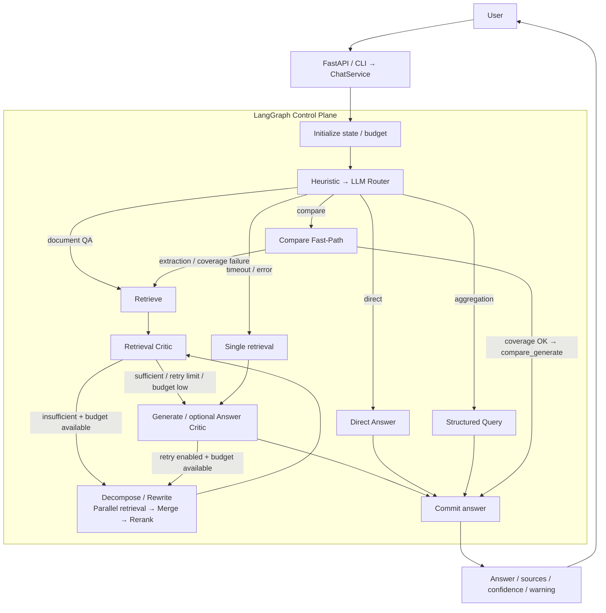

# Agentic RAG Control Plane

質問特性と実行状態に応じて処理経路を切り替え、残時間や検索結果の不足に応じて縮退する、LangGraph ベースの Agentic RAG 検証実装です。
不確実な LLM / RAG 実行を、明示的な **state / policy / routing / budget / fallback** によって制御します。

## Problem — 解決する課題

固定の `Question → Retrieval → Answer` フローでは、次の制御が別途必要になります。

- 検索不要の会話でも Retrieval を実行する。
- 非構造化文書の検索と、構造化データの集計を同じ処理へ流す。
- 比較質問で片方の対象しか取得できても、そのまま回答を生成する。
- LLM / Retrieval の timeout や根拠不足に対する後続処理が曖昧になる。
- 残時間が少なくても、再検索や品質評価を続ける。
- 経路選択・縮退・回答確定の判断を追跡しづらい。

## What This System Does

| Capability | 制御すること |
|---|---|
| Task-aware Routing | Heuristic → LLM Router で、検索・直接回答・構造化クエリを振り分ける。 |
| Agentic Retrieval | Hybrid Search の結果を Critic で確認し、不足時に分解・書き換え・再検索する。 |
| Structured Query | 売上・在庫サンプルを、検証済み Intent と SELECT テンプレートで集計する。 |
| Compare Fast-Path | 2対象を抽出して並列検索し、両対象の取得結果を統合して比較回答を生成する。 |
| Budget-aware Execution | 残時間から生成・コミット用の予約分を差し引き、任意処理の実行可否を判断する。 |
| Fallback / Degradation | Router 失敗、検索の部分失敗、予算不足に対する縮退経路を持つ。 |
| Observability | route・判断元・残 Budget・skip・warning・confidence をログや評価用 Trace へ記録する。 |

## Architecture

`ChatService` が Graph を実行し、`AgentState` に経路・中間結果・予算・警告を保持します。各処理は Domain services、DB / LLM / Memory は Infrastructure に分離しています。


```mermaid
flowchart TD
    User[User] --> Chat[FastAPI / CLI → ChatService]
    Chat --> Init
    subgraph CP[LangGraph Control Plane]
        Init[Initialize state / budget] --> Router[Heuristic → LLM Router]
        Router -->|direct| Direct[Direct Answer]
        Router -->|document QA| Retrieval[Retrieve]
        Router -->|aggregation| SQL[Structured Query]
        Router -->|compare| Compare[Compare Fast-Path]
        Router -->|timeout / error| Fallback[Single retrieval]
        Compare -->|extraction / coverage failure| Retrieval
        Retrieval --> Check[Retrieval Critic]
        Check -->|insufficient + budget available| Retry["Decompose / Rewrite<br/>Parallel retrieval → Merge → Rerank"]
        Retry --> Check
        Check -->|sufficient / retry limit / budget low| Generate[Generate / optional Answer Critic]
        Fallback --> Generate
        Generate -->|retry enabled + budget available| Retry
        Generate --> Commit[Commit answer]
        Direct --> Commit
        SQL --> Commit
        Compare -->|coverage OK → compare_generate| Commit
    end
    Commit --> Response[Answer / sources / confidence / warning]
    Response --> User
```

図は経路の概要です。Compare の抽出・coverage 判定で失敗した場合は通常検索へ戻り、`ENABLE_AGENTIC=false` の場合は単発検索へ戻ります。
各経路は `commit_answer` で最終回答を会話履歴へ追加して終了します。

## Key Engineering Decisions

| Decision | Why | Trade-off |
|---|---|---|
| 明示的な State Graph | Routing・再検索・Critic・Fallback・回答コミットの条件をコードで定義し、許可された経路を限定する。 | 状態の初期化・遷移・終了条件の整合性を管理する必要がある。 |
| Heuristic → LLM Routing | 明確なルールに一致した場合は、LLM Router の呼び出しを省く。 | キーワード・文字数・正規表現による誤分類とルール保守がある。 |
| Budget-aware Degradation | 残時間で任意処理を抑制し、全 Stage の完走を待たず生成へ進む。 | 縮退時は検索の広さや検証処理を減らす。 |
| タスクごとの経路分離 | 文書検索・数値集計・2対象比較に異なる処理と失敗条件を適用する。 | 経路ごとの実装・テスト・評価と、Fallback 先との状態共有が必要になる。 |

## Control Plane / Runtime Behavior

### Routing と Execution Paths

Heuristic の判定がしきい値を満たさない場合に LLM Router を呼びます。LLM Router の出力は3経路で、`definition` / `compare` の分類は Heuristic が担当します。

| Execution Path | 主な動作 |
|---|---|
| `direct_answer` | 検索・Critic を通さず、会話履歴から LLM が回答する。 |
| `agentic_retrieval` | 初回検索 → Retrieval Critic → 必要なら分解・再検索 → 生成 → 任意の Answer Critic。 |
| `structured_query_tool` | Parse → Validate → SELECT 実行 → 結果整形。書き込み要求や未対応の Intent は拒否する。 |
| `compare_fast_path` | A/B 抽出 → 対象別の並列検索 → 結果統合 → 専用 Prompt で比較回答。 |
| `fallback_retrieval` | Router の timeout / error 時に単発検索 → 生成。Answer Critic は残時間・根拠の有無などで分岐する。 |

Agentic Retrieval は pgvector と PostgreSQL FTS の結果を統合し、Retrieval Critic が不足と判断した場合、Budget の範囲で分解・書き換え・並列再検索へ進みます。
現行 Graph は `retry_count >= 2` で追加の再検索を打ち切ります。Answer Critic による再検索は既定で無効です。

### Budget-aware Execution

Budget は金額・Token 数ではなく、`time.monotonic()` の経過時間から計算する **時間予算** です。
生成・コミット用の予約分を考慮して、任意処理へ使える時間を判断します。

- Rerank の必要予算を下回れば、再スコアリングを省く。
- Retrieval Critic は残時間や取得結果の確信度に応じて省き、ルールによる coverage 判定を使う。
- Decompose / Rewrite を続けられない場合は再検索を打ち切り、生成へ進む。
- 並列検索用の予算が不足した場合は、元クエリ1本へ縮退する。
- Answer Critic も残時間・coverage・設定に応じて実行または省略する。

縮退状態は `fallback_level`、`skipped_stages`、`budget_pressure_reasons` などへ記録します。

### Fallback / Degradation

| 状況 | 実装上の対応 |
|---|---|
| LLM Router の timeout / error | `fallback_retrieval` へ移行し、単発検索を行う。 |
| Query Rewrite / Compression の失敗 | 元クエリ / 未圧縮チャンクを使う。 |
| Keyword Search の失敗 | Vector 側の取得結果で検索を続ける。 |
| サブクエリ検索の一部が例外で失敗 | 成功分を統合し、`partial_retrieval_used` と警告を記録する。 |
| サブクエリ検索の全失敗 / 統合結果なし | 縮退状態を記録し、生成へ進む。追加の単発再検索を必ず行うわけではない。 |
| Compare の抽出失敗 / 片方の取得結果なし | 通常検索へ戻る。coverage は両対象のチャンク取得有無で判定する。 |
| Critic の timeout / error | coverage に基づく代替判定と confidence の制限を使う。 |

Partial retrieval の成功数は検索呼び出しの成功数です。下位処理が失敗を空結果へ変換した場合、Graph の例外ベースの失敗カウントには現れません。

### Evidence-aware Answering

`agentic_retrieval` / `fallback_retrieval` では、Prompt が検索 Context にない情報を一般知識で補完しないよう指示します。
加えて `generate_node` は、Context・チャンクが空、または検索成功数が0の場合に、LLM で回答本文を生成せず固定の不足回答を設定します。

> 検索結果に十分な情報が見つかりませんでした。

`definition` には、Keyword のヒットがなく検索 confidence が低い場合などに、用語説明を不足回答へ置き換える guard もあります。
根拠が存在する場合の意味的な充足性は Prompt / Critic の判定に依存します。

### Memory / Prompt Resolution

会話履歴は `session_id` を LangGraph の `thread_id` として保持します。
Router / Critic / Generate などの Prompt は、Git 管理された `prompts/` の local snapshot を優先し、解決できない場合は埋め込み fallback を使います。
FastAPI 起動時に Prompt を prewarm し、LangSmith Hub は runtime の取得先ではなく [同期ツール](tools/sync_prompts_from_hub.py) の同期元として扱います。

## Validation / Observability

外部呼び出しを置き換えたテストで、経路選択・終了条件・縮退時の状態を検証する構成です。

| 検証対象 | Repository 内の Evidence |
|---|---|
| Heuristic / LLM Routing | [Heuristic tests](tests/test_heuristic_router.py)、[Router tests](tests/test_router_service.py)：ルール一致時の LLM 回避、未一致時の LLM 利用、timeout fallback。 |
| Compare | [Pipeline tests](tests/test_compare_pipeline.py)：専用経路の成功、抽出失敗時の通常検索への復帰。 |
| Budget / Fallback | [Budget tests](tests/test_retrieval_complex_budget.py)、[Fallback tests](tests/test_retrieval_complex_fallback.py)：予約時間、skip 判定、部分成功・全失敗・空結果。 |
| Critic | [Critic tests](tests/test_critic_fallbacks.py)：timeout 時の代替判定と confidence 制限。 |
| Structured Query | [Validator tests](tests/test_structured_query_validator.py)、[SQLite tests](tests/test_structured_query_sqlite_execution.py)：集計と未対応・書き込み要求の拒否。 |
| 実行 Trace | [Trace tests](tests/test_agent_run_trace.py)：route、tool 実行、引用、Budget、Fallback の評価用契約への変換。 |

`router_decision` / `chat_request_summary` などのイベントに、判断元、LLM Router 呼び出し有無、所要時間、縮退、警告、confidence を辞書形式で出力します。
[run_agent_trace.py](scripts/run_agent_trace.py) は、1回の実行を評価用 `AgentRunTrace` JSON として保存します。

[Router benchmark](scripts/benchmark_router.py) は Heuristic 有無の latency / fallback を、[Compare benchmark](scripts/benchmark_compare.py) は比較質問の分類・confidence・warning を集計します。
[evaluation/evaluate.py](evaluation/evaluate.py) には固定データセットの回答類似度・経路別 latency / 縮退を集計する処理があります。DB と OpenAI API を使用し、保存結果の集計・レポート生成はローカルで行えます。評価実行の制約は下記を参照してください。
保存済み結果はありますが、現在の HEAD・設定・データとの対応を特定できないため、ここでは性能値を掲載していません。

## Tech Stack

| 領域 | 技術 / 利用状況 |
|---|---|
| Runtime | Python 3.13+ / uv |
| Orchestration | LangGraph / LangChain |
| Interface | FastAPI / Uvicorn / CLI |
| Document Retrieval | PostgreSQL 16 / pgvector / PostgreSQL FTS (`simple`, `ts_rank`) |
| Structured Data | SQLite / 売上・在庫サンプル / SELECT テンプレート |
| LLM / Embedding | OpenAI `gpt-4o-mini` / `text-embedding-3-small`、評価 Judge は `gpt-4o` |
| Rerank | Cohere `rerank-multilingual-v3.0` は任意。既定は `ENABLE_RERANK=false` で Passthrough。利用時は `uv sync --extra rerank` でSDKを導入し、`ENABLE_RERANK=true` と `COHERE_API_KEY` を設定する。 |
| Local DB | Docker Compose（PostgreSQL の起動） |

## Quick Start

Python 3.13+、uv、Docker Compose、OpenAI API キーを用意し、Repository のルートで実行します。

```bash
uv sync
cp .env.example .env
# .env の OPENAI_API_KEY を設定する。
# tracing を使わない場合は LANGCHAIN_TRACING_V2=false にする。
# tracing を使う場合は LANGSMITH_API_KEY を設定する。

docker compose up -d
# PostgreSQL の起動完了後、文書検索用のサンプルを投入する。
uv run python -m infrastructure.retrieval.vector_store
# Structured Query 用のサンプルDBを作成する（再実行で既存テーブルを再作成）。
uv run python -m infrastructure.sqlite.seed_structured_query_db

uv run uvicorn api.main:app --reload
```

[API docs](http://localhost:8000/docs) の `POST /ask` に、例えば `{"session_id":"local-001","question":"RAGとは何ですか？"}` を送ります。
CLI は別ターミナルで `uv run python main.py` を実行します。文書の追加は API docs の `/ingest/file` を利用できます。
サンプル文書は最小セットなので、比較したい両対象の根拠は別途取り込む必要があります。

## Known Limitations

| 領域 | 現在の制約 |
|---|---|
| Compare 抽出 | 正規表現による2対象抽出。3対象以上や表記揺れを網羅的には扱わない。 |
| Compare 品質判定 | 生成後の `CompareQualityGate` は対象言及・回答構造・取得状況による軽量ルール判定。confidence はその内部指標、coverage は両対象の取得有無（0 / 1）で、意味的正しさを保証しない。通常の Answer Critic は通らない。 |
| Heuristic Router | キーワードによる誤分類がある。「メリットとデメリット」を別の比較対象として扱う場合がある。 |
| PostgreSQL FTS | `simple` config とクエリ正規化を使用。日本語の形態素解析には対応していない。内部フィールド名 `bm25_score` の実体は `ts_rank`。 |
| Budget / Failure | 外部 API の latency に依存し、全経路の厳密な締切ではない。生成や Compare 全体に残 Budget による中断はなく、未捕捉の例外もある。 |
| Confidence / Grounding | confidence はスコア・Critic・固定値を組み合わせた内部指標で、正答確率ではない。Prompt と Critic による根拠判定は事実性を保証しない。 |
| Memory | `MemorySaver` はプロセス内で保持し、再起動で消失する。 |
| Structured Query | 売上・在庫サンプルと限定された集計・条件の解析に対応。任意の Text-to-SQL や JOIN は扱わない。 |
| Ingestion | Markdown / HTML / TXT のみ。PDF は未対応で、ディレクトリ取り込みは直下のみ。 |
| Evaluation | データセットは回答期待値のみを持ち、route / query type 期待値は任意。Retrieval Ground Truth はなく、検索精度を測定しない。検索精度評価は `spec-rag-qa` が担当する。 |

## Related Projects / Further Documentation

| Project | 3層構造での責務 |
|---|---|
| [spec-rag-qa](https://github.com/mlprototype/spec-rag-qa) | 品質保証 / Evaluation |
| **ai-agent-rag（本 Repository）** | **動的制御 / Orchestration / Control Plane** |
| [policy-aware-llm-gateway](https://github.com/mlprototype/policy-aware-llm-gateway) | 運用統治 / Governance |

本 Repository の詳細資料：

- [Architecture / phase evolution](docs/phase-evolution.md)：構成と設計の変遷。
- [Observability](docs/observability.md)：ログイベントとフィールド。
- [Evaluation](docs/EVALUATION.md)：評価・レポートの運用手順。
- [Configuration](docs/configuration.md)：環境変数、Budget、Prompt 関連設定。
- [Project structure](docs/project-structure.md)：ファイル単位の責務。

詳細資料には設計時点の説明も含まれます。現在の挙動は実装を参照してください。
