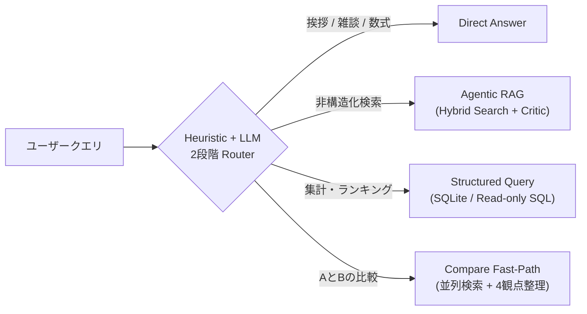

# Project One-Pager: Agentic RAG with Control Plane

非構造化 × 構造化データを統合的に扱う、LangGraph ベースの Production-ready RAG 基盤。
ルーティング・品質保証・段階的縮退を、明示的な状態遷移として制御する。

---

## 1. このシステムは何か

ユーザーのクエリを解釈し、**質問の性質に応じた最適な処理経路**を動的に選択する Agentic RAG 基盤です。

*   **非構造化データ**: Vector + Keyword の Hybrid Search による RAG 経路
*   **構造化データ**: SQLite 上の読み取り専用 SQL 実行による Structured Query 経路
*   **比較クエリ**: 対象を抽出し並列検索する Compare Fast-Path 経路
*   **Router**: Heuristic（ルールベース）で即判定し、不一致時のみ LLM へフォールバック

## 2. 何を解決するか

従来の単一経路型RAGでは、質問の種類にかかわらず「検索してから答える」流れになりやすく、不要な検索コストやレイテンシ、適切でない回答方式の選択が発生しやすいという課題があります。

本システムは、主に以下の課題を解決します。：

*   **無条件検索の回避**: 挨拶やLLMが既知の一般的事実に対する無駄な Retrieval を抑制
*   **データ種類に応じた経路分離**: 集計・ランキング系は SQL に、文脈理解系は RAG に振り分け
*   **品質 / レイテンシ / 縮退の制御**: タイムアウトや検索品質低下時に、段階的フォールバックで最低限の応答を保証
*   **企業利用を意識した安全性の確保**: 情報不足時に推測で補完せず、Strict RAG Policy や安全な Structured Query 実行により、誤回答や危険な実行を抑制

## 3. コア価値

| 領域 | 内容 |
| :--- | :--- |
| **Routing** | Heuristic + LLM の 2 段階ルーターで、高確信クエリは LLM 呼び出し 0 回で即決定 |
| **Retrieval** | Vector（pgvector） × Keyword（PG FTS）の Hybrid + Extractive Compression によるトークン削減 |
| **Structured Query** | Parse（解析） → Validate（検証） → SQL Build（構築） → Execute（実行） → Format（整形） の 5 段パイプライン。破壊的キーワードの実行時ブロックで安全性担保 |
| **Budget / Fallback** | full_path → optimization_skip → critic_skip → single_retrieval_fallback → minimal_answer の 5 段階縮退 |
| **Observability** | ルーティング判断・予算消費・縮退要因を構造化ログで可視化し、評価ダッシュボードで Before / After を追跡 |

## 4. 普通のRAGとの違い
本システムは、一般的な「質問 → 検索 → 回答」という直線的なRAGとは異なり、制御プレーンを持つ問い合わせ基盤 として設計されています。
*   **常に検索しない**: ルーターが「検索不要」と判断すれば直接生成に回す
*   **比較専用経路がある**: 単発検索では弱い「AとBの違い」系を、対象別並列検索 + 4 観点（共通点 / 相違点 / 向いているケース / 注意点）で構造化
*   **構造化データを別系統で処理**: 集計・ランキングはテキスト検索ではなく SQL で確定値を返す
*   **Strict RAG Policy**: 検索で裏付けが取れない場合、推測せず「分からない」と返すことで誤情報を回避
*   **Budget-aware な縮退制御**: 残予算に応じて rerank / critic / rewrite を段階的にスキップし、タイムアウト前に確実に応答

## 5. 一番重要な設計判断

*   **制御パラダイム**
    *   **LangGraph による明示的な状態遷移**
        暗黙的な Agent 自律性ではなく、制御可能性・予測可能性・可観測性を優先。
*   **運用・堅牢性**
    *   **Prompt Runtime は Local Snapshot を正本**
        LangSmith Hub は同期元として扱い、Hub 障害の影響を本番実行経路から遮断。差分は Git でレビュー可能。
    *   **Hallucination 抑止を優先**
        情報が不足している場合は推測で補完せず、「十分な根拠がない場合は答え切らない」設計を採用。
*   **拡張性**
    *   **Tool 増設可能な責務分離**
        Agent の思考フローと各種ツール（Retrieval / Structured Query / Compare 等）を完全に分離。

## 6. このプロジェクトが体現する技術スタンス

**「自律的に動くAI」ではなく、「制御可能で説明可能なAI基盤」を指向する。**

エンタープライズ導入で最も問われるのは、魔法のような知性ではなく、 再現性・可観測性・フォールバック可能性である。

本プロジェクトは、LangGraph × Clean Architecture × Prompt Ops の三本柱でこれを体現し、 Java/Spring Boot 系エンタープライズ基幹システムで培った「堅牢性・運用性・安全設計」の観点を、 LLM アプリケーション基盤に持ち込むことを狙いとしている。

## 7. 想定ユースケース
*   社内ドキュメントや仕様書を対象にしたナレッジ検索
*   製品や技術要素の比較問い合わせ
*   売上、在庫、件数、ランキングなどの構造化データ集計
*   情報不足時に無理に答えず、安全に応答する企業向け問い合わせ基盤
*   ルーティングや検索品質の変化を継続的に評価するAIシステム基盤