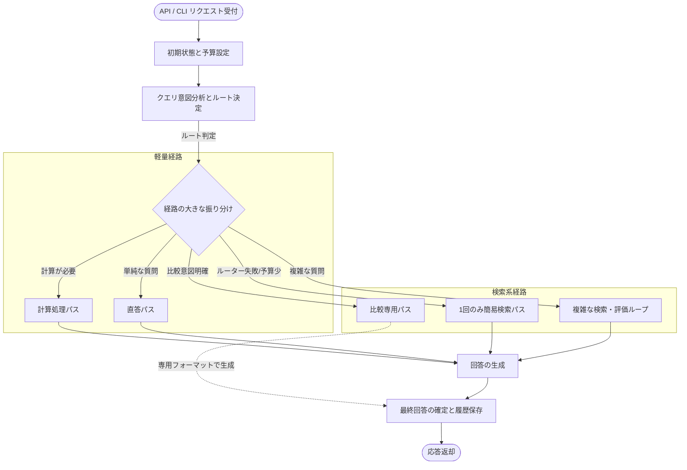

# 全体俯瞰図

リクエストがシステムに入ってから、どのような大きな経路を経て回答に至るかを示す図です。軽量経路と検索系経路を大きく分けて表現しています。

#### 補足
- **この図の主経路:** 初期設定 → ルーティング → 複雑な検索・評価ループ (Agentic) → 回答生成 → 確定
- **この図の fallback / 縮退経路:** ルーター失敗時などに Agentic ではなく「1回のみ簡易検索パス」へ落ちる経路
- **この図で重要な state 更新:** `initial_budget_ms` (予算設定), `route` (経路決定), `messages` (最終履歴)
- **省略したもの:** 各種ノード内部の詳細なループや、Compare Fast-Path 内部の抽出・マージロジック
- **対応する主要実装ファイル:** `application/agents/graph.py` (全体の Edge 定義)
