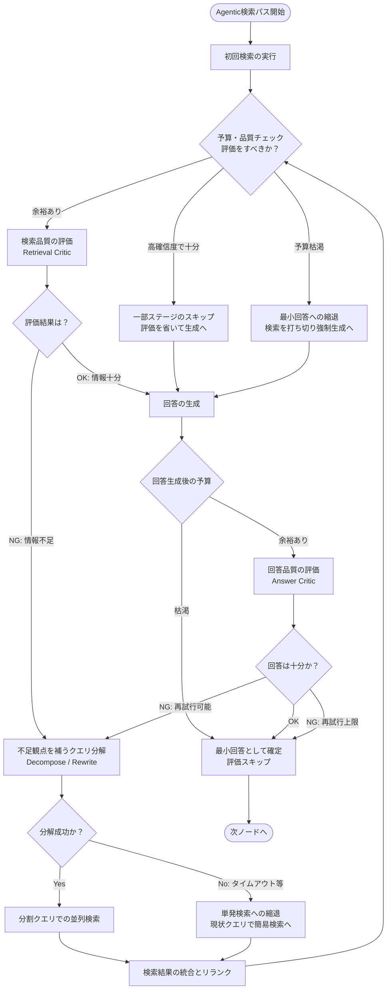

# retrieval_complex 詳細図

検索・評価・再試行のループと、予算枯渇時の様々な縮退（Fallback）段階を示す図です。

#### 補足
- **この図の主経路:** 検索 → 評価 (NG) → 分解 → 並列検索 → 統合 → 評価 (OK) → 生成 → 評価 (OK) → 確定
- **この図の fallback / 縮退経路:** 
  1. **一部ステージのスキップ**: 確信度が高い場合に Critic を飛ばす最適化
  2. **単発検索への縮退**: Decompose 等の処理がタイムアウトした場合、分割せずに単一クエリで検索を続行
  3. **最小回答への縮退**: 残り予算（`remaining_budget_ms`）が枯渇した場合、強制的にその時点のコンテキストで回答を生成・確定する
- **この図で重要な state 更新:** `remaining_budget_ms` (残り予算), `retrieval_ok` (検索完了フラグ), `sub_queries` (分割クエリ), `must_generate` (強制生成フラグ), `fallback_level` (現在の縮退レベル)
- **省略したもの:** Chunk や Document モデルの変換処理、タイムアウト秒数の微細な算出ロジック
- **対応する主要実装ファイル:** `application/agents/graph.py` (複雑検索系ノード全体), `domain/services/retrieval_budget.py`
