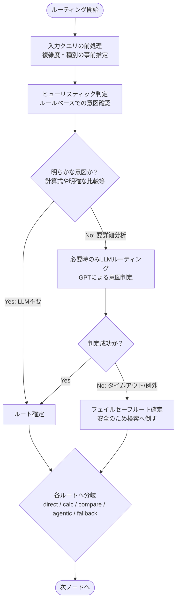

# ルーティング詳細図

なぜそのルートが選ばれるのか、LLMを使わずに済む条件やフェイルセーフの仕組みを示す図です。

#### 補足
- **この図の主経路:** 入力前処理 → ヒューリスティック判定 (No) → LLMルーティング → ルート確定
- **この図の fallback / 縮退経路:** LLMルーティングがタイムアウト・エラーした際に、安全に事実に基づかせるための `fallback_retrieval` へのフォールバック
- **この図で重要な state 更新:** `query_type` (推論された意図), `router_reason` (ルーティング理由), `router_uncertain` (ルーターの自信有無)
- **省略したもの:** 複雑度（low/medium/high）のスコアリングの具体的な条件式、予算の初期化詳細
- **対応する主要実装ファイル:** `application/agents/graph.py` (`router_node`), `domain/services/router.py`
