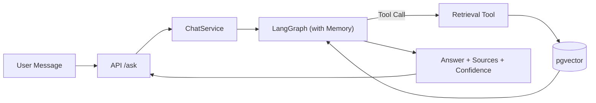
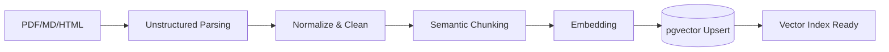

# Phase2 設計書: Production RAG System

作成日: 2026-03-13

## 0. 目的と前提

### 目的
Phase1 で構築した Agentic RAG Core を、企業利用に耐える Production RAG へ拡張する。重点領域は以下の4点。

1. Conversation Memory
2. Citation 付き回答
3. Document Ingestion Pipeline
4. Advanced Chunking

### 前提 (Phase1 現状)
- LangGraph Agent による tool routing
- pgvector ベースの Vector DB
- Tool calling / Streaming / Timeout / Prompt versioning / Tracing
- Seed 文書のみで検索可能

### 非ゴール
- 全面的な UI / 管理画面の構築
- SLA / セキュリティ監査対応の完全実装
- マルチテナント課金・権限の完成形

---

## 1. アーキテクチャ全体像

### 1.1 コンポーネント追加 (概念)
- Conversation Memory: LangGraph checkpointer を導入
- Citation: Retrieval 結果の構造化と回答生成の引用整備
- Ingestion Pipeline: PDF/Markdown/HTML の取り込みと更新検知
- Advanced Chunking: セマンティック分割の導入

### 1.2 主要データフロー (チャット)


### 1.3 主要データフロー (Ingestion)


---

## 2. Conversation Memory (multi-turn chat)

### 2.1 要件
- ユーザー単位の会話履歴を保持し、複数ターンで参照可能
- Session / Thread 単位に分離
- 保存期間やトークン上限に応じたメモリ制御

### 2.2 設計方針
- LangGraph の checkpointer を導入
- Phase2 初期は `MemorySaver` を使用
- 企業運用に向け、永続ストアへ切替可能な構造を維持

### 2.3 実装構成 (想定)
1. Graph compile 時に checkpointer を渡す
2. API で `session_id` を受け取り、`thread_id` として config に付与
3. メモリ保持のため、一定量を超えた履歴は要約 or windowing

#### API 変更案
```json
{
  "session_id": "uuid",
  "question": "LangGraphとは？"
}
```

#### 呼び出しイメージ
```
config = { "configurable": { "thread_id": session_id } }
graph.invoke(inputs, config=config)
```

### 2.4 メモリ制御ポリシー
- `max_messages`: 例 20
- `max_tokens`: 例 4000
- 超過時は以下のどちらか
  - Sliding window で最新のみ保持
  - 要約メッセージを挿入

---

## 3. Citation 付き回答

### 3.1 要件
- `answer` に加えて `sources` と `confidence` を返す
- 回答中の根拠が追跡可能
- 監査やエラー解析に耐える構造化出力

### 3.2 レスポンススキーマ (案)
```json
{
  "answer": "...",
  "sources": [
    {
      "doc_id": "architecture.md",
      "chunk_id": "architecture.md#c12",
      "title": "Architecture Overview",
      "score": 0.91,
      "snippet": "..."
    }
  ],
  "confidence": 0.78
}
```

### 3.3 Citation パイプライン
1. Retrieval Service が `Document` を構造化して返却
2. `doc_id / chunk_id / score / snippet` を保持
3. LLM には `citation_id` を含んだコンテキストを渡す
4. 生成時に `[...]` 形式で参照番号を付与
5. 出力時に参照番号と `sources` を整合させる

### 3.4 Confidence 設計 (初期)
簡易モデル:
- `confidence = f(top1_score, top1_top2_margin, tool_used)`  
例:  
```
confidence = clamp(0.2 + 0.6*top1 + 0.2*margin, 0, 1)
```
- Retrieval 未使用の場合は低めに補正

---

## 4. Document Ingestion Pipeline

### 4.1 要件
- PDF / Markdown / HTML を取り込み
- 既存データとの重複排除
- 取り込みのバッチ実行が可能

### 4.2 推奨ライブラリ
- `unstructured` を利用して共通パーサ層を構築
- 同一フォーマットで `Document` を生成

### 4.3 パイプライン設計
1. **Source Discovery**
   - ローカルディレクトリ / S3 / URL などを走査
2. **Parsing**
   - unstructured により PDF/HTML/MD を解析
3. **Normalize**
   - 改行 / 空白 / タグ除去
4. **Chunking**
   - Semantic chunking を実施
5. **Embedding**
   - 既存の embedding モデルでベクトル化
6. **Upsert**
   - `doc_id + chunk_id` で upsert

### 4.4 メタデータ設計
```json
{
  "doc_id": "policy.pdf",
  "chunk_id": "policy.pdf#p3#c7",
  "source_type": "pdf",
  "source_uri": "/docs/policy.pdf",
  "title": "Security Policy",
  "page": 3,
  "section": "Access Control",
  "content_hash": "sha256..."
}
```

### 4.5 更新検知
- `content_hash` を用いて差分更新
- 既存 chunk と hash が一致すればスキップ

---

## 5. Advanced Chunking (Semantic Chunking)

### 5.1 要件
- 固定文字数ではなく意味単位で分割
- 文書構造 (見出し/段落) を尊重

### 5.2 アプローチ
二段階 chunking:
1. 構造ベース: 見出し/セクションごとに分割
2. セマンティック: embeddings の境界変化でさらに分割

### 5.3 チャンク設計パラメータ例
- `target_tokens`: 300-500
- `max_tokens`: 800
- `overlap_tokens`: 40-80

### 5.4 期待効果
- 質問と関連するまとまりを保つ
- ノイズの少ない retrieval
- Citation の信頼性向上

---

## 6. 影響範囲 (コードレイヤ)

### 6.1 Application 層
追加/変更候補:
- `application/services/chat_service.py`  
  - `session_id` 受け取り
  - citations/confidence を返却
- `application/dto/chat_models.py`  
  - `ChatRequest` に `session_id`
  - `ChatResponse` に `confidence`

### 6.2 Domain 層
追加/変更候補:
- `domain/services/retrieval_service.py`
  - 文字列ではなく構造化 `RetrievedChunk` を返す
- `domain/services/ingestion_service.py`
  - 取り込みオーケストレーション

### 6.3 Adapters / Infrastructure 層
追加/変更候補:
- `adapters/tools/retrieval_tool.py`
  - JSON 出力対応
- `infrastructure/ingestion/*`
  - unstructured パーサ
- `infrastructure/retrieval/vector_store.py`
  - upsert / delete API の拡張

---

## 7. 成功基準 (Phase2 ゴール)

1. Multi-turn で文脈が保持される
2. `answer + sources + confidence` のレスポンスを返す
3. PDF/Markdown/HTML を ingestion できる
4. Semantic chunking により検索精度が改善する

---

## 8. リスクと対策

- **Memory肥大化**: TTL / windowing / summary を導入
- **誤引用**: chunk_id の厳密トラッキングと検証
- **誤差のある confidence**: まずは heuristic、後に LLM 評価を導入
- **取り込み時間の増大**: 差分更新 / バッチ化で対処

---

## 9. 次のアクション

1. `Conversation Memory` の実装に着手 (MemorySaver + session_id)
2. `Citation` の JSON スキーマ確定と Retrieval 出力変更
3. `Ingestion Pipeline` の PoC (PDF/MD/HTML ingest)
4. `Semantic Chunking` の導入・評価

