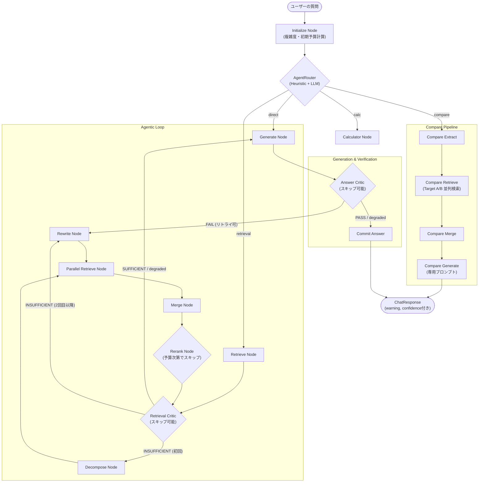

# Phase 3: Agentic Retrieval 設計書 v3 (Control Plane 導入)

## 改訂履歴

| バージョン | 変更内容 |
| :--- | :--- |
| v1 | 初版（QueryDecompose → Parallel → Rerank → Critic → Generate） |
| v2 | ①Reranker Feature Flag化、②Dual Critic追加、③State軽量化、④Lazy Decomposition、⑤MAX_RETRY=3 |
| **v3** (現在) | **Control Plane導入**: ①予算（Budget）管理とGraceful Degradation追加、②`Compare`専用パイプライン追加、③ヒューリスティックRouter、④Criticの動的スキップ最適化 |

---

## 1. 設計思想：v3 での Control Plane 導入による進化

v2 の Agentic RAG は高精度でしたが、「どんな質問でも一律で同じステップ（Critic 等）を踏む」ため、無駄なレイテンシやタイムアウト時のフォールバックが弱点でした。v3 では**Control Plane**の概念を取り入れ、状況に応じた最適な経路選択と予算管理を行います。

### ❶ レイテンシ予算（Budget）管理と Graceful Degradation
ユーザーが許容できる待機時間（予算: ms）を設定し、残り時間に応じて処理を**段階的にスキップ**（Graceful Degradation）します。
- `remaining_budget_ms` を計算し、各ノードのタイムアウト時間を動的に制御
- 予算が逼迫した場合の挙動:
  - `retrieval_degraded` フラグ: RewriteやRerankなど重い処理をスキップ
  - `must_generate` フラグ: すぐに Generate に直行する
  - フォールバックレベル（`fallback_level`）の記録: `optimization_skip`, `critic_skip`, `single_retrieval_fallback`, `minimal_answer`

### ❷ Heuristic Routing と Query Classification
全てのクエリをLLM Routerに通すのではなく、事前にルールベース（Heuristic）でクエリ種別を判別することでレイテンシを削減します。
- **分類:** `calc`, `compare`, `definition`, `direct`, `retrieval_complex`
- **複雑度:** `low`, `medium`, `high` （文字数や「比較」「なぜ」などのキーワードで判定）

### ❸ 比較（Compare）に特化した専用パイプライン
「AとBの違い」のような比較クエリは、通常の検索では片方に偏りやすいため、専用の高速経路を追加しました。
- `compare_extract` → `compare_retrieve`（A・Bそれぞれ並列検索）→ `compare_merge` → `compare_generate`

### ❹ Critic の動的スキップ（Optimization）
予算の節約とレイテンシ改善のため、検索結果が明らかに高品質な場合はCriticをスキップします。
- `retrieval_critic_skip_confidence` / `answer_critic_skip_confidence` を基準値として、一定以上のスコアとチャンク数が確保できている場合は評価をパス（`high_confidence` でスキップ）。

---

## 2. 改訂版エージェントフロー (v3)



---

## 3. ノード責務一覧 (v3 更新分)

| # | ノード | 責務 | v3の変更点 |
| :--- | :--- | :--- | :--- |
| 1 | **initialize** | 初期化とクエリの複雑度・予算(`initial_budget_ms`)の計算 | ★NEW |
| 2 | **router** | HeuristicまたはLLMによる経路ルーティング | Heuristic追加 |
| 3 | **compare_extract** | 比較対象のエンティティ(A, B)と観点を抽出 | ★NEW |
| 4 | **compare_retrieve** | 対象A, 対象Bを同時に並列検索 | ★NEW |
| 5 | **compare_merge** | AとBの検索結果を統合・カバレッジ検証 | ★NEW |
| 6 | **compare_generate** | 比較用プロンプトで回答生成 | ★NEW |
| 7 | **retrieve** | 検索実行（予算更新を含む） |
| 8 | **retrieval_critic** | 検索結果の評価 | 予算・Confidenceによる**Skipロジック**追加 |
| 9 | **decompose/rewrite** | クエリ分解・改善 | タイムアウト時のGraceful Degradation追加 |
| 10 | **parallel_retrieve** | Sub-queryの並列検索 | 予算逼迫時はSub-query数を絞るなど制御 |
| 11 | **merge** | 検索結果の重複排除と統合 |
| 12 | **rerank** | チャンクの再ランク付け | 予算逼迫時(`budget_min_for_rerank_ms`未満)はSkip |
| 13 | **generate** | Citation付き回答生成 | `retrieval_quality_level`や`warning`に応じたメッセージ付与 |
| 14 | **answer_critic** | 回答のハルシネーション評価 | 予算・Confidenceによる**Skipロジック**追加 |

---

## 4. コンポーネント詳細設計 (Control Plane 拡張)

### 4.1 Budget 管理機能 (`retrieval_budget.py`)

状態（State）の `initial_budget_ms` に対し、`budget_started_at` と現在時刻を比較して `remaining_budget_ms` を算出します。

**Graceful Degradation のしきい値:**
- `force_generate_threshold_ms` (1500ms): 残り予算がこれを下回った場合、それ以上の検索系・評価系処理を中止し、即座に Generate へ遷移（`must_generate` = True）。
- `retrieval_degrade_threshold_ms` (2000ms): 残り予算がこれを下回った場合、高コストな最適化（Rewrite, Rerank等）をスキップ（`retrieval_degraded` = True）。

---

### 4.2 State の更新 (v3)

`AgentState` は Control Plane のメタデータを持つよう大幅に拡張されました。

```python
class AgentState(TypedDict, total=False):
    # ... v2 までのフィールド ...
    messages: list[BaseMessage]
    original_query: str
    sub_queries: list[str]
    confidence: float
    sources: list[dict[str, Any]]
    
    # --- v3 Control Plane 新規フィールド ---
    query_type: Literal["direct", "calc", "compare", "definition", "retrieval_complex"]
    routing_layer: Literal["heuristic", "llm", "fallback"]
    query_complexity: Literal["low", "medium", "high"]
    
    # Compare
    compare_targets: dict[str, Any] | None
    compare_aspect: str | None
    compare_extract_success: bool
    
    # Budget
    initial_budget_ms: int
    remaining_budget_ms: int
    budget_started_at: float
    force_generate: bool
    must_generate: bool
    retrieval_degraded: bool
    
    # Monitoring / Degradation Flags
    fallback_level: Literal["full_path", "optimization_skip", "critic_skip", "single_retrieval_fallback", "minimal_answer"]
    skipped_stages: list[str]
    timeout_stages: list[str]
    retrieval_quality_level: str
    warning_codes: list[str]
```

---

### 4.3 警告と品質レベル（Warning & Quality Level）

最終的な Generate ノードでは、これまでの経路で発生した劣化（Degradation）に基づいて、ユーザーに回答の不確実性を通知します（`build_user_warning`）。

- **fallback_level = `minimal_answer`**: 「十分な検索結果が得られず、最小限の回答を行いました。」
- **partial_retrieval_used**: 「一部の検索工程を省略して回答を生成しました。」
- **fallback_level = `single_retrieval_fallback` 等**: 「十分な検索予算を確保できず、簡略化した経路で回答しています。」

これらは `retrieval_quality_level` (high / medium / low) としてもトラッキングされ、評価指標に利用可能です。

---

## 5. 主要な環境変数 (v3 追加分)

`config/settings.py` で管理される v3 の主要な閾値・環境変数です。

| 環境変数 | デフォルト | 説明 |
| :--- | :--- | :--- |
| `ROUTER_HEURISTIC_ENABLED` | `true` | ヒューリスティックルーティングの有効化 |
| `COMPLEX_BUDGET_MS_LOW` | `4000` | 複雑度Low時の初期予算 (ms) |
| `COMPLEX_BUDGET_MS_MEDIUM` | `7000` | 複雑度Medium時の初期予算 (ms) |
| `COMPLEX_BUDGET_MS_HIGH` | `9000` | 複雑度High時の初期予算 (ms) |
| `BUDGET_TOTAL_RETRIEVAL_COMPLEX_MS`| `15000` | Agentic RAGの最大予算 (ms) |
| `RETRIEVAL_DEGRADE_THRESHOLD_MS` | `2000` | この予算を下回るとRerank等をスキップ |
| `FORCE_GENERATE_THRESHOLD_MS` | `1500` | この予算を下回ると強制Generate |
| `RETRIEVAL_CRITIC_SKIP_CONFIDENCE_PCT` | `85` | 検索自信度が85%超でCriticをスキップ |
| `ANSWER_CRITIC_SKIP_CONFIDENCE_PCT` | `80` | 生成自信度が80%超でCriticをスキップ |

---

## 6. まとめ: v3 アーキテクチャの強み

1. **耐障害性とUX向上**: 複雑なクエリでAPIの遅延が起きても、全工程がタイムアウトして失敗するのではなく、「時間が足りないからRerankを諦める」「Criticを飛ばす」ことで**確実になんらかの回答を返す**ようになりました。
2. **高速化**: わかりやすいクエリ（`query_complexity = low`）や、一度の検索で十分な精度が出たクエリは、各種CriticやDecomposeをスキップするため、**不必要なトークン消費や待機時間を削減**します。
3. **比較クエリの精度劇的向上**: 従来 RAG が苦手としていた「AとBの比較」を専用パイプラインで処理することで、情報の欠落やハルシネーションを防ぎ、体系的な比較回答が可能になりました。
